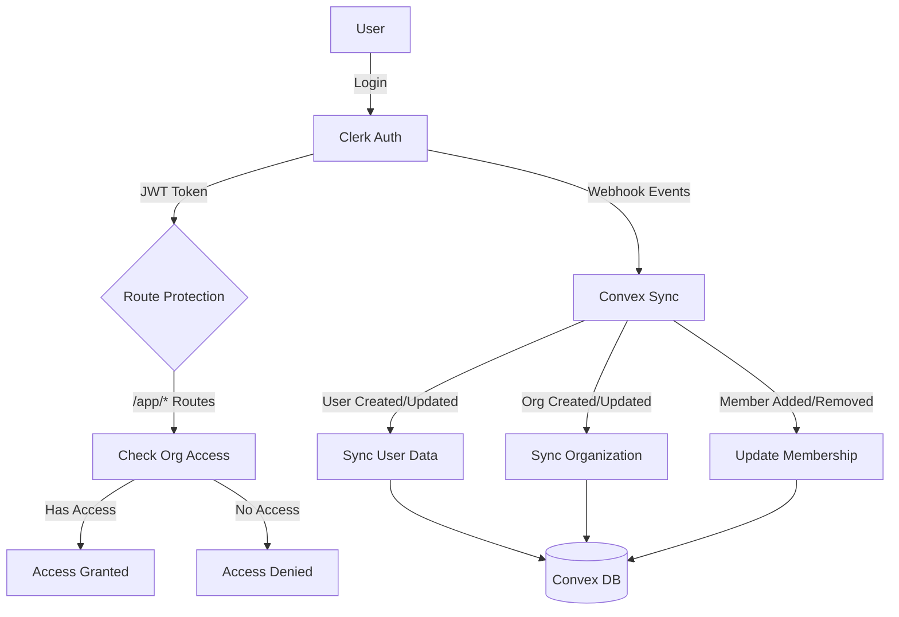

# Authentication & Authorization

## Overview

VECTR0 uses **Clerk** for authentication, organization management, and role-based access control (RBAC). Clerk organizations are synchronized with Convex via webhooks to maintain a single source of truth for multi-tenant data isolation.

## Authentication Architecture



## Organization Management

### Clerk Organizations

Clerk organizations provide multi-tenant isolation with automatic user assignment and role management.

```typescript
// packages/convex/schema.ts
import { defineSchema, defineTable } from "convex/server";
import { v } from "convex/values";

export default defineSchema({
  organizations: defineTable({
    clerkOrgId: v.string(), // Clerk organization ID
    name: v.string(),
    slug: v.string(),
    metadata: v.optional(v.object({
      hospitalSystem: v.optional(v.string()),
      department: v.optional(v.string()),
      timezone: v.optional(v.string()),
    })),
    settings: v.optional(v.object({
      scheduleConfig: v.optional(v.any()),
      preferences: v.optional(v.any()),
    })),
    createdAt: v.number(),
    updatedAt: v.number(),
  })
    .index("by_clerk_id", ["clerkOrgId"])
    .index("by_slug", ["slug"]),
  
  users: defineTable({
    clerkUserId: v.string(), // Clerk user ID
    email: v.string(),
    name: v.optional(v.string()),
    imageUrl: v.optional(v.string()),
    organizationId: v.optional(v.id("organizations")),
    role: v.union(
      v.literal("super_admin"),
      v.literal("admin"),
      v.literal("user")
    ),
    metadata: v.optional(v.any()),
    createdAt: v.number(),
    updatedAt: v.number(),
  })
    .index("by_clerk_id", ["clerkUserId"])
    .index("by_organization", ["organizationId"])
    .index("by_email", ["email"]),
    
  organizationMemberships: defineTable({
    userId: v.id("users"),
    organizationId: v.id("organizations"),
    role: v.string(), // org-specific role
    joinedAt: v.number(),
  })
    .index("by_user", ["userId"])
    .index("by_organization", ["organizationId"])
    .index("by_user_org", ["userId", "organizationId"]),
});
```

## Webhook Sync Implementation

### Webhook Handler

```typescript
// packages/convex/http.ts
import { httpRouter } from "convex/server";
import { clerkWebhook } from "./webhooks/clerk";

const http = httpRouter();

// Clerk webhook endpoint
http.route({
  path: "/clerk-webhook",
  method: "POST",
  handler: clerkWebhook,
});

export default http;
```

### Clerk Webhook Processing

```typescript
// packages/convex/webhooks/clerk.ts
import { httpAction } from "../_generated/server";
import { internal } from "../_generated/api";
import { Webhook } from "svix";

export const clerkWebhook = httpAction(async (ctx, request) => {
  // Verify webhook signature
  const webhookSecret = process.env.CLERK_WEBHOOK_SECRET;
  if (!webhookSecret) {
    throw new Error("Missing CLERK_WEBHOOK_SECRET");
  }

  const svix_id = request.headers.get("svix-id");
  const svix_timestamp = request.headers.get("svix-timestamp");
  const svix_signature = request.headers.get("svix-signature");

  if (!svix_id || !svix_timestamp || !svix_signature) {
    return new Response("Missing svix headers", { status: 400 });
  }

  const body = await request.text();
  
  const wh = new Webhook(webhookSecret);
  let evt: any;
  
  try {
    evt = wh.verify(body, {
      "svix-id": svix_id,
      "svix-timestamp": svix_timestamp,
      "svix-signature": svix_signature,
    });
  } catch (err) {
    console.error("Webhook verification failed", err);
    return new Response("Unauthorized", { status: 401 });
  }
  
  // Handle different event types
  switch (evt.type) {
    case "user.created":
    case "user.updated":
      await ctx.runMutation(internal.users.syncUser, {
        clerkUserId: evt.data.id,
        email: evt.data.email_addresses[0]?.email_address,
        name: `${evt.data.first_name || ""} ${evt.data.last_name || ""}`.trim(),
        imageUrl: evt.data.image_url,
        metadata: evt.data.public_metadata,
      });
      break;
      
    case "organization.created":
    case "organization.updated":
      await ctx.runMutation(internal.organizations.syncOrganization, {
        clerkOrgId: evt.data.id,
        name: evt.data.name,
        slug: evt.data.slug,
        metadata: evt.data.public_metadata,
      });
      break;
      
    case "organizationMembership.created":
      await ctx.runMutation(internal.organizations.addMember, {
        clerkUserId: evt.data.public_user_data.user_id,
        clerkOrgId: evt.data.organization.id,
        role: evt.data.role,
      });
      break;
      
    case "organizationMembership.deleted":
      await ctx.runMutation(internal.organizations.removeMember, {
        clerkUserId: evt.data.public_user_data.user_id,
        clerkOrgId: evt.data.organization.id,
      });
      break;
      
    case "user.deleted":
      await ctx.runMutation(internal.users.deleteUser, {
        clerkUserId: evt.data.id,
      });
      break;
      
    case "organization.deleted":
      await ctx.runMutation(internal.organizations.deleteOrganization, {
        clerkOrgId: evt.data.id,
      });
      break;
  }
  
  return new Response("OK", { status: 200 });
});
```

## Sync Mutations

### User Synchronization

```typescript
// packages/convex/users.ts
import { internalMutation } from "./_generated/server";
import { v } from "convex/values";

export const syncUser = internalMutation({
  args: {
    clerkUserId: v.string(),
    email: v.string(),
    name: v.optional(v.string()),
    imageUrl: v.optional(v.string()),
    metadata: v.optional(v.any()),
  },
  handler: async (ctx, args) => {
    // Check if user exists
    const existingUser = await ctx.db
      .query("users")
      .withIndex("by_clerk_id", (q) => q.eq("clerkUserId", args.clerkUserId))
      .first();
      
    if (existingUser) {
      // Update existing user
      await ctx.db.patch(existingUser._id, {
        email: args.email,
        name: args.name,
        imageUrl: args.imageUrl,
        metadata: args.metadata,
        updatedAt: Date.now(),
      });
      return existingUser._id;
    } else {
      // Create new user
      const userId = await ctx.db.insert("users", {
        clerkUserId: args.clerkUserId,
        email: args.email,
        name: args.name,
        imageUrl: args.imageUrl,
        metadata: args.metadata,
        role: args.metadata?.role || "user",
        createdAt: Date.now(),
        updatedAt: Date.now(),
      });
      return userId;
    }
  },
});

export const deleteUser = internalMutation({
  args: { clerkUserId: v.string() },
  handler: async (ctx, args) => {
    const user = await ctx.db
      .query("users")
      .withIndex("by_clerk_id", (q) => q.eq("clerkUserId", args.clerkUserId))
      .first();
      
    if (user) {
      // Delete user's memberships first
      const memberships = await ctx.db
        .query("organizationMemberships")
        .withIndex("by_user", (q) => q.eq("userId", user._id))
        .collect();
        
      for (const membership of memberships) {
        await ctx.db.delete(membership._id);
      }
      
      // Delete user
      await ctx.db.delete(user._id);
    }
  },
});
```

### Organization Synchronization

```typescript
// packages/convex/organizations.ts
import { internalMutation } from "./_generated/server";
import { v } from "convex/values";

export const syncOrganization = internalMutation({
  args: {
    clerkOrgId: v.string(),
    name: v.string(),
    slug: v.string(),
    metadata: v.optional(v.any()),
  },
  handler: async (ctx, args) => {
    const existing = await ctx.db
      .query("organizations")
      .withIndex("by_clerk_id", (q) => q.eq("clerkOrgId", args.clerkOrgId))
      .first();
      
    if (existing) {
      await ctx.db.patch(existing._id, {
        name: args.name,
        slug: args.slug,
        metadata: args.metadata,
        updatedAt: Date.now(),
      });
      return existing._id;
    } else {
      const orgId = await ctx.db.insert("organizations", {
        clerkOrgId: args.clerkOrgId,
        name: args.name,
        slug: args.slug,
        metadata: args.metadata,
        createdAt: Date.now(),
        updatedAt: Date.now(),
      });
      return orgId;
    }
  },
});

export const addMember = internalMutation({
  args: {
    clerkUserId: v.string(),
    clerkOrgId: v.string(),
    role: v.string(),
  },
  handler: async (ctx, args) => {
    // Get user and organization
    const user = await ctx.db
      .query("users")
      .withIndex("by_clerk_id", (q) => q.eq("clerkUserId", args.clerkUserId))
      .first();
      
    const org = await ctx.db
      .query("organizations")
      .withIndex("by_clerk_id", (q) => q.eq("clerkOrgId", args.clerkOrgId))
      .first();
      
    if (!user || !org) {
      console.error("User or organization not found", { user, org });
      return;
    }
    
    // Check if membership exists
    const existing = await ctx.db
      .query("organizationMemberships")
      .withIndex("by_user_org", (q) => 
        q.eq("userId", user._id).eq("organizationId", org._id)
      )
      .first();
      
    if (existing) {
      // Update role if changed
      await ctx.db.patch(existing._id, { role: args.role });
    } else {
      // Create membership
      await ctx.db.insert("organizationMemberships", {
        userId: user._id,
        organizationId: org._id,
        role: args.role,
        joinedAt: Date.now(),
      });
    }
    
    // Update user's primary organization if not set
    if (!user.organizationId) {
      await ctx.db.patch(user._id, { 
        organizationId: org._id,
        updatedAt: Date.now(),
      });
    }
  },
});

export const removeMember = internalMutation({
  args: {
    clerkUserId: v.string(),
    clerkOrgId: v.string(),
  },
  handler: async (ctx, args) => {
    const user = await ctx.db
      .query("users")
      .withIndex("by_clerk_id", (q) => q.eq("clerkUserId", args.clerkUserId))
      .first();
      
    const org = await ctx.db
      .query("organizations")
      .withIndex("by_clerk_id", (q) => q.eq("clerkOrgId", args.clerkOrgId))
      .first();
      
    if (!user || !org) return;
    
    // Find and delete membership
    const membership = await ctx.db
      .query("organizationMemberships")
      .withIndex("by_user_org", (q) => 
        q.eq("userId", user._id).eq("organizationId", org._id)
      )
      .first();
      
    if (membership) {
      await ctx.db.delete(membership._id);
    }
    
    // Clear primary organization if it matches
    if (user.organizationId === org._id) {
      await ctx.db.patch(user._id, { 
        organizationId: undefined,
        updatedAt: Date.now(),
      });
    }
  },
});

export const deleteOrganization = internalMutation({
  args: { clerkOrgId: v.string() },
  handler: async (ctx, args) => {
    const org = await ctx.db
      .query("organizations")
      .withIndex("by_clerk_id", (q) => q.eq("clerkOrgId", args.clerkOrgId))
      .first();
      
    if (!org) return;
    
    // Delete all memberships
    const memberships = await ctx.db
      .query("organizationMemberships")
      .withIndex("by_organization", (q) => q.eq("organizationId", org._id))
      .collect();
      
    for (const membership of memberships) {
      await ctx.db.delete(membership._id);
    }
    
    // Clear organization from users
    const users = await ctx.db
      .query("users")
      .withIndex("by_organization", (q) => q.eq("organizationId", org._id))
      .collect();
      
    for (const user of users) {
      await ctx.db.patch(user._id, { 
        organizationId: undefined,
        updatedAt: Date.now(),
      });
    }
    
    // Delete organization
    await ctx.db.delete(org._id);
  },
});
```

## Frontend Integration

### Organization Context Hook

```typescript
// apps/web/src/app/hooks/useOrganization.ts
import { useOrganization as useClerkOrg, useUser } from '@clerk/clerk-react';
import { useQuery } from '@vectr0/convex/react';
import { api } from '@vectr0/convex';

export function useOrganization() {
  const { organization: clerkOrg, isLoaded: orgLoaded } = useClerkOrg();
  const { user, isLoaded: userLoaded } = useUser();
  
  // Get Convex organization
  const convexOrg = useQuery(
    api.organizations.getByClerkId,
    clerkOrg ? { clerkOrgId: clerkOrg.id } : "skip"
  );
  
  // Get user's role in organization
  const membership = useQuery(
    api.organizations.getUserMembership,
    convexOrg && user ? {
      clerkUserId: user.id,
      organizationId: convexOrg._id
    } : "skip"
  );
  
  return {
    organization: convexOrg,
    clerkOrganization: clerkOrg,
    membership,
    isOrgAdmin: membership?.role === "admin" || membership?.role === "super_admin",
    isSystemAdmin: user?.publicMetadata?.role === "super_admin",
    isLoaded: orgLoaded && userLoaded,
  };
}
```

### Route Protection

```typescript
// apps/web/src/app/components/ProtectedRoute.tsx
import { useAuth, useOrganization as useClerkOrg } from '@clerk/clerk-react';
import { Navigate } from '@tanstack/react-router';
import { useOrganization } from '../hooks/useOrganization';

interface ProtectedRouteProps {
  children: React.ReactNode;
  requireOrg?: boolean;
  requireOrgAdmin?: boolean;
  requireSystemAdmin?: boolean;
}

export function ProtectedRoute({ 
  children, 
  requireOrg = true,
  requireOrgAdmin = false,
  requireSystemAdmin = false 
}: ProtectedRouteProps) {
  const { isSignedIn, isLoaded: authLoaded } = useAuth();
  const { organization, isOrgAdmin, isSystemAdmin, isLoaded } = useOrganization();
  
  if (!authLoaded || !isLoaded) {
    return <div>Loading...</div>;
  }
  
  if (!isSignedIn) {
    return <Navigate to="/sign-in" />;
  }
  
  if (requireOrg && !organization) {
    return <Navigate to="/create-organization" />;
  }
  
  if (requireOrgAdmin && !isOrgAdmin) {
    return <div>Access denied. Organization admin required.</div>;
  }
  
  if (requireSystemAdmin && !isSystemAdmin) {
    return <div>Access denied. System admin required.</div>;
  }
  
  return <>{children}</>;
}
```

## User Roles

### Role Definitions

| Role | Scope | Capabilities |
|------|-------|--------------|
| **super_admin** | **System-wide Super Admin** | • **Access to ALL organizations and data**<br>• Platform administration and configuration<br>• User and organization management<br>• System analytics and monitoring<br>• Billing and subscription management<br>• Security and compliance oversight |
| **admin** | Single Organization | • Manage organization settings and configuration<br>• Invite/remove organization members<br>• View organization analytics and reports<br>• Configure schedules and preferences<br>• Manage organization billing (future) |
| **user** | Single Organization | • View assigned schedules<br>• Submit scheduling preferences<br>• Trade shifts with colleagues<br>• Manage personal profile<br>• Basic calendar integration |

### Role Hierarchy & Access

```
super_admin (System Super Admin)
├── Can access ALL organizations
├── Can impersonate any user
├── Can create/delete organizations
├── Can promote/demote any user
└── Full platform access

admin (Organization Admin)  
├── Can only access assigned organization(s)
├── Cannot access other organizations
├── Can manage members within their org
└── Limited to organization-scoped features

user (Standard User)
├── Can only access assigned organization(s)  
├── Cannot manage other users
├── Read-only access to schedules
└── Basic functionality only
```

### Setting User Roles

```typescript
// Via Clerk Dashboard - Set in public metadata
{
  "role": "super_admin" // For system super admins
}

// Via API for organization roles
await ctx.db.insert("organizationMemberships", {
  userId: userId,
  organizationId: orgId,
  role: "admin", // or "user"
  joinedAt: Date.now(),
});
```

## Webhook Configuration

### Setting Up Clerk Webhooks

1. **Navigate to Clerk Dashboard → Webhooks**

2. **Create New Endpoint:**
```
Endpoint URL: https://[your-project].convex.cloud/clerk-webhook
```

3. **Select Events:**
- user.created
- user.updated
- user.deleted
- organization.created
- organization.updated
- organization.deleted
- organizationMembership.created
- organizationMembership.updated
- organizationMembership.deleted

4. **Copy Webhook Secret and Add to Convex:**
```bash
npx convex env set CLERK_WEBHOOK_SECRET "whsec_..."
```

5. **Deploy Webhook Handler:**
```bash
pnpm --filter=@vectr0/convex deploy
```

## Security Considerations

### Webhook Security

```typescript
// Prevent replay attacks
const timestampMs = parseInt(svix_timestamp) * 1000;
const now = Date.now();
const fiveMinutes = 5 * 60 * 1000;

if (now - timestampMs > fiveMinutes) {
  return new Response("Timestamp too old", { status: 400 });
}
```

### Data Consistency

- All user/org operations go through Clerk first
- Convex data is synchronized via webhooks
- Implement retry logic for failed webhook processing
- Regular reconciliation jobs to ensure sync

### Multi-tenant Isolation

```typescript
// Always filter by organization in queries
export const getSchedules = query({
  handler: async (ctx) => {
    const identity = await ctx.auth.getUserIdentity();
    const user = await getUserByClerkId(ctx, identity.subject);
    
    if (!user?.organizationId) {
      return [];
    }
    
    return await ctx.db
      .query("schedules")
      .withIndex("by_organization", (q) => 
        q.eq("organizationId", user.organizationId)
      )
      .collect();
  },
});
```

## Testing

### Webhook Testing

```typescript
// Test webhook handler locally
describe('Clerk Webhook Handler', () => {
  test('creates user on user.created event', async () => {
    const mockEvent = {
      type: 'user.created',
      data: {
        id: 'user_123',
        email_addresses: [{ email_address: 'test@example.com' }],
        first_name: 'Test',
        last_name: 'User',
      }
    };
    
    const response = await clerkWebhook(mockEvent);
    expect(response.status).toBe(200);
    
    const user = await db.query('users')
      .withIndex('by_clerk_id', q => q.eq('clerkUserId', 'user_123'))
      .first();
      
    expect(user).toBeDefined();
    expect(user.email).toBe('test@example.com');
  });
});
```

### Manual Webhook Trigger

```bash
# Trigger webhook manually from Clerk Dashboard
# Webhooks → Select endpoint → Test → Send test event
```

## Environment Variables

```bash
# apps/web/.env
PUBLIC_CLERK_PUBLISHABLE_KEY=pk_live_...
PUBLIC_CLERK_SIGN_IN_URL=/sign-in
PUBLIC_CLERK_SIGN_UP_URL=/sign-up
PUBLIC_CLERK_AFTER_SIGN_IN_URL=/app/dashboard
PUBLIC_CLERK_AFTER_SIGN_UP_URL=/app/onboarding

# packages/convex/.env
CLERK_WEBHOOK_SECRET=whsec_...
```

## Key Takeaways

1. **Clerk is the source of truth** for users and organizations
2. **Webhooks maintain sync** between Clerk and Convex
3. **Multi-tenant isolation** through organization scoping
4. **Role-based access** at both system and organization levels
5. **Webhook security** with signature verification and replay protection
6. **Graceful handling** of webhook failures and retries