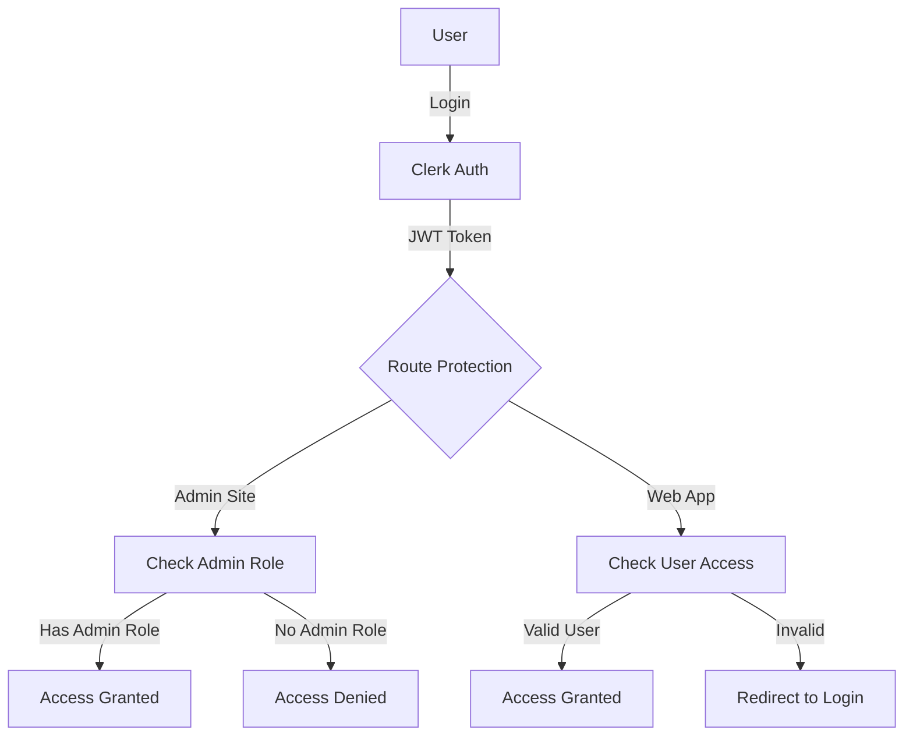

# Authentication & Authorization

## Overview

VECTR0 uses **Clerk** for authentication with role-based access control (RBAC) to manage permissions across the platform.

## Authentication Architecture



## Access Control

### Admin Site (admin.vectr0.com)

**⚠️ IMPORTANT: Only users with `admin` role can access the admin site.**

```typescript
// apps/admin/src/middleware/auth.ts
import { clerkMiddleware, createRouteMatcher } from '@clerk/nextjs/server';

const isProtectedRoute = createRouteMatcher(['(.*)']);

export default clerkMiddleware((auth, req) => {
  if (isProtectedRoute(req)) {
    // Check if user has admin role
    const { userId, sessionClaims } = auth();
    
    if (!userId) {
      return auth().redirectToSignIn();
    }
    
    const userRole = sessionClaims?.metadata?.role;
    
    if (userRole !== 'admin') {
      // Redirect non-admin users to the main web app
      return Response.redirect(new URL('https://app.vectr0.com', req.url));
    }
  }
});
```

### Web App (app.vectr0.com)

**Regular users and admins can access the web app.**

```typescript
// apps/web/src/middleware/auth.ts
import { clerkMiddleware, createRouteMatcher } from '@clerk/nextjs/server';

const isProtectedRoute = createRouteMatcher([
  '/dashboard(.*)',
  '/schedule(.*)',
  '/settings(.*)'
]);

export default clerkMiddleware((auth, req) => {
  if (isProtectedRoute(req)) {
    auth().protect(); // Simply requires authentication, no role check
  }
});
```

## User Roles

### Role Definitions

| Role | Access Level | Capabilities |
|------|-------------|--------------|
| **admin** | Full platform access | • Access admin dashboard<br>• Manage all organizations<br>• View analytics<br>• System configuration<br>• User management |
| **org_admin** | Organization management | • Manage organization settings<br>• Invite/remove users<br>• View organization analytics<br>• Cannot access admin site |
| **user** | Standard access | • Use web app features<br>• Manage own profile<br>• View assigned schedules<br>• Cannot access admin site |

### Setting User Roles

#### Via Clerk Dashboard

1. Navigate to Clerk Dashboard → Users
2. Select a user
3. Edit user metadata
4. Add role to public metadata:

```json
{
  "role": "admin"
}
```

#### Via API (Convex Function)

```typescript
// packages/convex/functions/users.ts
import { mutation } from "./_generated/server";
import { clerkClient } from "@clerk/backend";

export const setUserRole = mutation({
  args: {
    userId: v.string(),
    role: v.union(v.literal("admin"), v.literal("org_admin"), v.literal("user"))
  },
  handler: async (ctx, args) => {
    // Verify current user is admin
    const identity = await ctx.auth.getUserIdentity();
    if (!identity) throw new Error("Unauthorized");
    
    const currentUserRole = identity.publicMetadata?.role;
    if (currentUserRole !== "admin") {
      throw new Error("Only admins can change user roles");
    }
    
    // Update role in Clerk
    await clerkClient.users.updateUserMetadata(args.userId, {
      publicMetadata: {
        role: args.role
      }
    });
    
    // Update in database
    await ctx.db.patch(args.userId, {
      role: args.role,
      updatedAt: Date.now()
    });
    
    return { success: true };
  }
});
```

## Implementation Guide

### 1. Admin Site Protection

```typescript
// apps/admin/src/App.tsx
import { ClerkProvider, SignIn, useUser } from '@clerk/clerk-react';
import { Navigate } from 'react-router-dom';

function AdminApp() {
  return (
    <ClerkProvider publishableKey={import.meta.env.VITE_CLERK_PUBLISHABLE_KEY}>
      <AdminGuard>
        <Routes>
          {/* Admin routes */}
        </Routes>
      </AdminGuard>
    </ClerkProvider>
  );
}

function AdminGuard({ children }: { children: React.ReactNode }) {
  const { user, isLoaded } = useUser();
  
  if (!isLoaded) return <div>Loading...</div>;
  
  if (!user) {
    return <SignIn redirectUrl="/dashboard" />;
  }
  
  const userRole = user.publicMetadata?.role;
  
  if (userRole !== 'admin') {
    return (
      <div className="min-h-screen flex items-center justify-center">
        <div className="text-center">
          <h1 className="text-2xl font-bold text-red-600">Access Denied</h1>
          <p className="mt-2">You don't have permission to access the admin panel.</p>
          <a href="https://app.vectr0.com" className="mt-4 text-blue-500 underline">
            Go to Web App
          </a>
        </div>
      </div>
    );
  }
  
  return <>{children}</>;
}
```

### 2. Convex Function Protection

```typescript
// packages/convex/lib/auth.ts
export async function requireAdmin(ctx: QueryCtx | MutationCtx) {
  const identity = await ctx.auth.getUserIdentity();
  
  if (!identity) {
    throw new Error("Not authenticated");
  }
  
  const role = identity.publicMetadata?.role;
  
  if (role !== 'admin') {
    throw new Error("Admin access required");
  }
  
  return identity;
}

// Usage in functions
export const getSystemStats = query({
  handler: async (ctx) => {
    await requireAdmin(ctx); // Throws if not admin
    
    // Admin-only logic here
    return await ctx.db.query("systemStats").collect();
  }
});
```

### 3. Environment-Specific Login URLs

```typescript
// apps/admin/src/config/auth.ts
export const authConfig = {
  signInUrl: '/sign-in',
  signUpUrl: null, // Disable sign-up for admin site
  afterSignInUrl: '/dashboard',
  appearance: {
    elements: {
      rootBox: 'admin-login',
      card: 'admin-card',
      headerTitle: 'Admin Portal - Authorized Personnel Only'
    }
  }
};

// apps/web/src/config/auth.ts  
export const authConfig = {
  signInUrl: '/sign-in',
  signUpUrl: '/sign-up',
  afterSignInUrl: '/dashboard',
  appearance: {
    elements: {
      rootBox: 'user-login',
      card: 'user-card',
      headerTitle: 'Welcome to VECTR0'
    }
  }
};
```

## Security Considerations

### Admin Access

1. **Limited Admin Accounts**: Keep admin accounts to a minimum
2. **Regular Audits**: Review admin access quarterly
3. **Activity Logging**: Track all admin actions
4. **Two-Factor Authentication**: Require 2FA for admin accounts

```typescript
// Enforce 2FA for admin users
const enforce2FAForAdmins = async (userId: string, role: string) => {
  if (role === 'admin') {
    await clerkClient.users.update(userId, {
      twoFactorEnabled: true,
      twoFactorRequired: true
    });
  }
};
```

### Session Management

```typescript
// apps/admin/src/hooks/useAdminSession.ts
export function useAdminSession() {
  const { session } = useSession();
  
  useEffect(() => {
    // Auto-logout after 30 minutes of inactivity for admin
    let timeout: NodeJS.Timeout;
    
    const resetTimeout = () => {
      clearTimeout(timeout);
      timeout = setTimeout(() => {
        session?.end();
      }, 30 * 60 * 1000); // 30 minutes
    };
    
    window.addEventListener('mousemove', resetTimeout);
    window.addEventListener('keypress', resetTimeout);
    
    resetTimeout();
    
    return () => {
      clearTimeout(timeout);
      window.removeEventListener('mousemove', resetTimeout);
      window.removeEventListener('keypress', resetTimeout);
    };
  }, [session]);
}
```

## Testing Access Control

### Test Scenarios

```typescript
// tests/auth/admin-access.test.ts
describe('Admin Site Access Control', () => {
  test('Admin user can access admin dashboard', async () => {
    const user = await createTestUser({ role: 'admin' });
    const response = await request(app)
      .get('/admin/dashboard')
      .set('Authorization', `Bearer ${user.token}`);
    expect(response.status).toBe(200);
  });
  
  test('Regular user cannot access admin dashboard', async () => {
    const user = await createTestUser({ role: 'user' });
    const response = await request(app)
      .get('/admin/dashboard')
      .set('Authorization', `Bearer ${user.token}`);
    expect(response.status).toBe(403);
  });
  
  test('Org admin cannot access system admin dashboard', async () => {
    const user = await createTestUser({ role: 'org_admin' });
    const response = await request(app)
      .get('/admin/dashboard')
      .set('Authorization', `Bearer ${user.token}`);
    expect(response.status).toBe(403);
  });
});
```

## Migration & Setup

### Initial Admin User Setup

```bash
# Script to create first admin user
# scripts/create-admin.ts

import { clerkClient } from '@clerk/backend';

async function createInitialAdmin() {
  const email = process.env.INITIAL_ADMIN_EMAIL;
  const password = process.env.INITIAL_ADMIN_PASSWORD;
  
  if (!email || !password) {
    throw new Error('INITIAL_ADMIN_EMAIL and INITIAL_ADMIN_PASSWORD required');
  }
  
  // Create user in Clerk
  const user = await clerkClient.users.create({
    emailAddress: [email],
    password,
    publicMetadata: {
      role: 'admin'
    },
    privateMetadata: {
      isInitialAdmin: true
    }
  });
  
  console.log('Admin user created:', user.id);
  console.log('Please enable 2FA immediately after first login');
}

createInitialAdmin().catch(console.error);
```

### Environment Variables

```bash
# .env.production (Admin Site)
VITE_CLERK_PUBLISHABLE_KEY=pk_live_xxxxx
VITE_REQUIRE_ROLE=admin
VITE_REDIRECT_NON_ADMIN=https://app.vectr0.com

# .env.production (Web App)
VITE_CLERK_PUBLISHABLE_KEY=pk_live_xxxxx
VITE_ALLOW_SIGNUP=true
VITE_DEFAULT_ROLE=user
```

## Monitoring & Alerts

### Admin Access Logging

```typescript
// packages/convex/functions/audit.ts
export const logAdminAccess = mutation({
  args: {
    action: v.string(),
    resource: v.string(),
    details: v.optional(v.any())
  },
  handler: async (ctx, args) => {
    const identity = await ctx.auth.getUserIdentity();
    
    await ctx.db.insert("auditLogs", {
      userId: identity?.subject,
      userEmail: identity?.email,
      action: args.action,
      resource: args.resource,
      details: args.details,
      timestamp: Date.now(),
      ip: ctx.request?.ip // If available
    });
  }
});
```

### Alert on Suspicious Activity

```typescript
// Monitor for suspicious admin access patterns
const detectSuspiciousAdminActivity = async () => {
  // Alert if admin login from new location
  // Alert if multiple failed admin login attempts
  // Alert if admin actions outside business hours
  // Alert if bulk data exports by admin
};
```

## Key Takeaways

1. **Admin site requires `admin` role** - Regular users are redirected to web app
2. **Role checking happens at multiple levels** - Middleware, components, and API
3. **Admin accounts need extra security** - 2FA, session timeouts, activity logging
4. **Clear separation of concerns** - Admin site for system management, web app for users
5. **Audit everything** - Log all admin actions for compliance and security