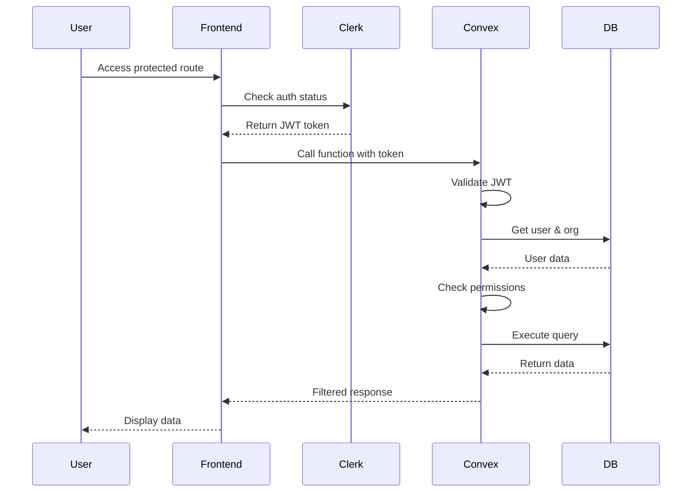

# Backend Architecture

## Service Architecture

Since we're using Convex (serverless), our backend is organized as functions:

### Function Organization

```text
packages/convex/
├── _generated/           # Auto-generated Convex files
├── functions/
│   ├── schedules.ts      # Schedule management
│   ├── users.ts          # User sync & CRUD
│   ├── organizations.ts  # Organization sync & management
│   ├── preferences.ts    # Preference handling
│   ├── trades.ts         # Shift trading
│   ├── holidays.ts       # Holiday management
│   └── analytics.ts      # Analytics queries
├── actions/
│   ├── ai-scheduler.ts   # AI integration
│   ├── calendar-sync.ts  # Calendar APIs
│   └── notifications.ts  # Email/push notifications
├── webhooks/
│   └── clerk.ts          # Clerk webhook handlers
├── lib/
│   ├── auth.ts          # Auth helpers
│   ├── multi-tenant.ts  # Org isolation
│   └── validators.ts    # Zod schemas
├── http.ts              # HTTP router for webhooks
└── schema.ts            # Database schema
```

### Function Template

```typescript
// functions/schedules.ts
import { v } from "convex/values";
import { mutation, query, action } from "./_generated/server";
import { withOrgAuth } from "../lib/auth";
import { generateAISchedule } from "../actions/ai-scheduler";

export const generateSchedule = action(
  withOrgAuth({
    args: {
      period: v.object({
        startDate: v.string(),
        endDate: v.string(),
      }),
      constraints: v.object({
        respectPTO: v.boolean(),
        enforceHolidays: v.boolean(),
        balanceWorkload: v.boolean(),
      }),
    },
    handler: async (ctx, args) => {
      // Fetch all required data
      const [staffUsers, holidays, ptoRequests, shifts] = await Promise.all([
        ctx.runQuery(internal.users.getStaffByOrg, { organizationId: ctx.orgId }),
        ctx.runQuery(internal.holidays.getByOrg, { organizationId: ctx.orgId }),
        ctx.runQuery(internal.pto.getApproved, { organizationId: ctx.orgId }),
        ctx.runQuery(internal.shifts.getActive, { organizationId: ctx.orgId }),
      ]);

      // Generate schedule using AI
      const schedule = await generateAISchedule({
        staffUsers,
        holidays,
        ptoRequests,
        shifts,
        period: args.period,
        constraints: args.constraints,
      });

      // Save to database
      const scheduleId = await ctx.runMutation(internal.schedules.create, {
        organizationId: ctx.orgId,
        period: args.period,
        assignments: schedule.assignments,
        metadata: schedule.metadata,
      });

      // Track analytics
      await ctx.runMutation(internal.analytics.trackGeneration, {
        scheduleId,
        fulfillmentScore: schedule.metadata.fulfillmentScore,
      });

      return scheduleId;
    },
  })
);
```

## Webhook Architecture

### Clerk Webhook Integration

Clerk webhooks maintain synchronization between Clerk (authentication source of truth) and Convex (application data).

```typescript
// packages/convex/http.ts
import { httpRouter } from "convex/server";
import { clerkWebhook } from "./webhooks/clerk";

const http = httpRouter();

http.route({
  path: "/clerk-webhook",
  method: "POST",
  handler: clerkWebhook,
});

export default http;
```

### Webhook Events Handled

| Event Type | Action | Purpose |
|------------|--------|----------|
| user.created | Create user in Convex | Initial user setup |
| user.updated | Update user data | Profile changes |
| user.deleted | Delete user & memberships | Account removal |
| organization.created | Create org in Convex | New tenant setup |
| organization.updated | Update org data | Settings changes |
| organization.deleted | Delete org & data | Tenant removal |
| organizationMembership.created | Add user to org | Team member addition |
| organizationMembership.deleted | Remove user from org | Team member removal |

### Webhook Security

```typescript
// webhooks/clerk.ts
import { Webhook } from "svix";

export const clerkWebhook = httpAction(async (ctx, request) => {
  // 1. Verify signature
  const wh = new Webhook(process.env.CLERK_WEBHOOK_SECRET!);
  const evt = wh.verify(payload, headers);
  
  // 2. Prevent replay attacks
  const timestamp = parseInt(headers.get("svix-timestamp"));
  if (Date.now() - timestamp > 5 * 60 * 1000) {
    return new Response("Timestamp too old", { status: 400 });
  }
  
  // 3. Process event
  await processWebhookEvent(ctx, evt);
  
  return new Response("OK", { status: 200 });
});
```

## Schema and Data Migrations

### Convex Migration Strategy

When modifying database schemas in Convex, use the migration system to safely update existing data:

#### Migration Workflow

```typescript
// convex/migrations.ts
import { migrations } from "convex/server";

// Example: Adding Clerk integration fields to existing users
export const addClerkFieldsToUsers = migrations.define({
  table: "users",
  migrateOne: async (ctx, user) => {
    // Add new required fields safely
    if (user.clerkId === undefined) {
      await ctx.db.patch(user._id, {
        clerkId: null, // Will be populated via webhook
        organizationId: null,
        organizationRole: null,
      });
    }
  },
});

// Example: Data transformation migration
export const normalizeUserRoles = migrations.define({
  table: "users", 
  migrateOne: async (ctx, user) => {
    // Transform legacy role formats
    if (user.role === "administrator") {
      await ctx.db.patch(user._id, { role: "admin" });
    }
  },
});
```

#### Schema Versioning Strategy

1. **Phase 1 - Schema Preparation**: Make new fields optional
```typescript
// convex/schema.ts - Transitional state
export default defineSchema({
  users: defineTable({
    // Existing required fields
    email: v.string(),
    name: v.string(),
    
    // New optional fields during migration
    clerkId: v.optional(v.string()),
    organizationId: v.optional(v.string()),
    
    // ... other fields
  })
  .index("by_email", ["email"])
  .index("by_clerk_id", ["clerkId"]), // Index on optional field is safe
});
```

2. **Phase 2 - Run Migration**: Deploy and execute migration
```bash
# Deploy schema with optional fields
npx convex deploy

# Test migration with dry run
npx convex run migrations:addClerkFieldsToUsers --dryRun=true

# Execute actual migration
npx convex run migrations:addClerkFieldsToUsers

# Monitor progress
npx convex run migrations:status
```

3. **Phase 3 - Schema Finalization**: Make fields required after data is migrated
```typescript
// convex/schema.ts - Final state
export default defineSchema({
  users: defineTable({
    // Now all fields are required
    email: v.string(),
    name: v.string(),
    clerkId: v.string(),
    organizationId: v.string(),
    // ... other fields
  })
  .index("by_email", ["email"])
  .index("by_clerk_id", ["clerkId"]),
});
```

#### Migration Best Practices

- **Always use optional fields** during transition periods
- **Handle both old and new data formats** in your function code during migration
- **Test with `dryRun: true`** before applying real migrations  
- **Run migrations in batches** to avoid timeouts on large datasets
- **Monitor migration progress** and be prepared to restart if needed
- **Back up critical data** before major migrations (use Convex export)

#### Migration Commands

```bash
# List all defined migrations
npx convex run migrations:list

# Check migration status
npx convex run migrations:status

# Run specific migration with dry run
npx convex run migrations:myMigration --dryRun=true

# Execute migration
npx convex run migrations:myMigration

# Cancel running migration (if needed)
npx convex run migrations:cancel --migrationId=<id>
```

## Database Architecture

### Convex Document Schema

Our database uses Convex's document-based architecture. For detailed schema definitions, see [Data Models](./data-models.md).

Key collections include:
- **organizations** - Multi-tenant root entities synced from Clerk
- **users** - Authentication entities synced from Clerk users  
- **organizationMemberships** - Many-to-many user/org relationships
- **schedulableContacts** - People who can be scheduled (may or may not have user accounts)
- **schedules** - Scheduling periods with assignments
- **shifts** - Shift definitions and requirements
- **shiftAssignments** - Assignment of contacts to shifts on specific dates

## Authentication and Authorization

### Auth Flow



### Middleware/Guards

```typescript
/**
 * @fileoverview Authentication utilities for Convex backend functions only.
 * This module provides helpers for user authentication and organization-based 
 * access control in Convex queries, mutations, and actions.
 * 
 * @warning These functions are for Convex backend use only. Do not use in frontend code.
 */

// lib/auth.ts
import { customCtx } from "convex-helpers/server/customFunctions";
import { QueryCtx, MutationCtx, ActionCtx } from "./_generated/server";

/**
 * Retrieves and validates the authenticated user with multi-organization support.
 * Automatically handles different Convex context types (Query/Mutation vs Action).
 * 
 * @param ctx - Convex context (QueryCtx, MutationCtx, or ActionCtx)
 * @param requiredOrgId - Optional organization ID to verify access to
 * @returns Promise resolving to authenticated user data with organization membership context
 * @throws {Error} "Unauthorized" if no valid identity found
 * @throws {Error} "User not found" if user doesn't exist in database
 * @throws {Error} "User has no active organization memberships" if user has no orgs
 * @throws {Error} "Access denied" if user not member of required organization
 * 
 * @example
 * ```typescript
 * // In a Convex query/mutation - default org
 * export const getMySchedules = query({
 *   handler: async (ctx, args) => {
 *     const { user, membership } = await getAuthenticatedUser(ctx);
 *     return ctx.db.query("schedules")
 *       .withIndex("by_organization", (q) => q.eq("organizationId", membership.organizationId))
 *       .collect();
 *   },
 * });
 * ```
 * 
 * @example
 * ```typescript
 * // In a mutation with specific org requirement
 * export const createSchedule = mutation({
 *   args: { organizationId: v.id("organizations") },
 *   handler: async (ctx, args) => {
 *     const { user, membership } = await getAuthenticatedUser(ctx, args.organizationId);
 *     if (!["admin"].includes(membership.role)) throw new Error("Admin required");
 *     // Process data for specified organization
 *   },
 * });
 * ```
 * 
 * @convexOnly This function is designed exclusively for Convex backend functions.
 * Do not use in React components or frontend code.
 */
export async function getAuthenticatedUser(
  ctx: QueryCtx | MutationCtx | ActionCtx, 
  requiredOrgId?: Id<"organizations">
) {
  const identity = await ctx.auth.getUserIdentity();
  if (!identity) throw new Error("Unauthorized");

  let user;
  if ("runQuery" in ctx) {
    // Action context - use internal query
    user = await ctx.runQuery(internal.users.getByClerkId, {
      clerkId: identity.subject,
    });
  } else {
    // Query/Mutation context - direct database access
    user = await ctx.db
      .query("users")
      .withIndex("by_clerk_id", (q) => q.eq("clerkId", identity.subject))
      .unique();
  }

  if (!user) throw new Error("User not found");

  // Get user's organization memberships
  let memberships;
  if ("runQuery" in ctx) {
    memberships = await ctx.runQuery(internal.users.getMemberships, {
      userId: user._id,
    });
  } else {
    memberships = await ctx.db
      .query("organizationMemberships")
      .withIndex("by_user", (q) => q.eq("userId", user._id))
      .filter((q) => q.eq(q.field("status"), "active"))
      .collect();
  }

  if (memberships.length === 0) {
    throw new Error("User has no active organization memberships");
  }

  // If specific org required, verify access
  if (requiredOrgId) {
    const membership = memberships.find(m => m.organizationId === requiredOrgId);
    if (!membership) {
      throw new Error("Access denied: User not member of required organization");
    }
    return { user, membership, availableOrgs: memberships };
  }

  // Return default org or first available
  const defaultMembership = memberships.find(m => m.isDefault) || memberships[0];
  return { user, membership: defaultMembership, availableOrgs: memberships };
}

/**
 * Enhanced Convex context wrapper that provides authenticated user data.
 * Uses getAuthenticatedUser internally for consistent authentication.
 * 
 * @param ctx - Convex context  
 * @returns Enhanced context with user authentication data
 * 
 * @example
 * ```typescript
 * export const adminOnlyFunction = mutation(
 *   withOrgAuth({
 *     args: { scheduleId: v.id("schedules") },
 *     handler: async (ctx, args) => {
 *       if (!ctx.isAdmin) throw new Error("Admin access required");
 *       // Admin-only logic with ctx.orgId available
 *     },
 *   })
 * );
 * ```
 * 
 * @convexOnly This wrapper is designed exclusively for Convex backend functions.
 */
export const withOrgAuth = customCtx(async (ctx) => {
  return await getAuthenticatedUser(ctx);
});
```
