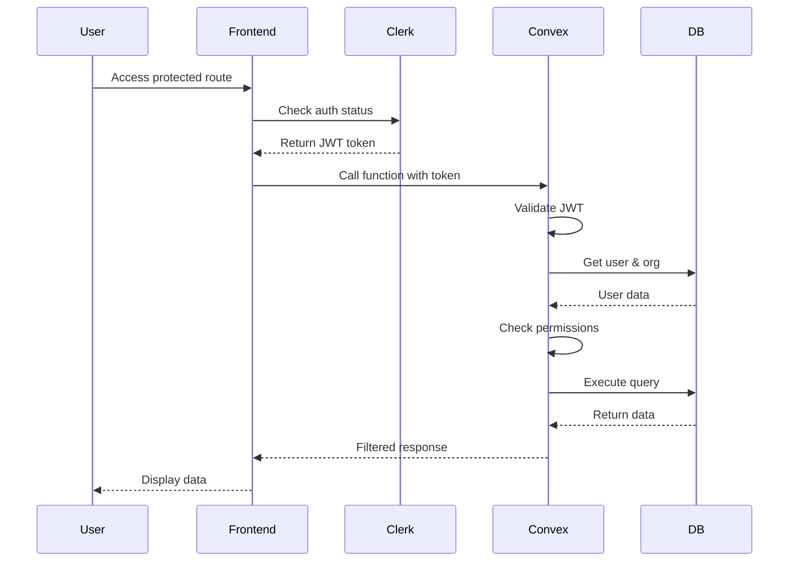

# Backend Architecture

## Service Architecture

Since we're using Convex (serverless), our backend is organized as functions:

### Function Organization

```text
packages/convex/
├── _generated/           # Auto-generated Convex files
├── functions/
│   ├── schedules.ts      # Schedule management
│   ├── users.ts          # User CRUD
│   ├── preferences.ts    # Preference handling
│   ├── trades.ts         # Shift trading
│   ├── holidays.ts       # Holiday management
│   └── analytics.ts      # Analytics queries
├── actions/
│   ├── ai-scheduler.ts   # AI integration
│   ├── calendar-sync.ts  # Calendar APIs
│   └── notifications.ts  # Email/push notifications
├── lib/
│   ├── auth.ts          # Auth helpers
│   ├── multi-tenant.ts  # Org isolation
│   └── validators.ts    # Zod schemas
└── schema.ts            # Database schema
```

### Function Template

```typescript
// functions/schedules.ts
import { v } from "convex/values";
import { mutation, query, action } from "./_generated/server";
import { withOrgAuth } from "../lib/auth";
import { generateAISchedule } from "../actions/ai-scheduler";

export const generateSchedule = action(
  withOrgAuth({
    args: {
      period: v.object({
        startDate: v.string(),
        endDate: v.string(),
      }),
      constraints: v.object({
        respectPTO: v.boolean(),
        enforceHolidays: v.boolean(),
        balanceWorkload: v.boolean(),
      }),
    },
    handler: async (ctx, args) => {
      // Fetch all required data
      const [staffUsers, holidays, ptoRequests, shifts] = await Promise.all([
        ctx.runQuery(internal.users.getStaffByOrg, { organizationId: ctx.orgId }),
        ctx.runQuery(internal.holidays.getByOrg, { organizationId: ctx.orgId }),
        ctx.runQuery(internal.pto.getApproved, { organizationId: ctx.orgId }),
        ctx.runQuery(internal.shifts.getActive, { organizationId: ctx.orgId }),
      ]);

      // Generate schedule using AI
      const schedule = await generateAISchedule({
        staffUsers,
        holidays,
        ptoRequests,
        shifts,
        period: args.period,
        constraints: args.constraints,
      });

      // Save to database
      const scheduleId = await ctx.runMutation(internal.schedules.create, {
        organizationId: ctx.orgId,
        period: args.period,
        assignments: schedule.assignments,
        metadata: schedule.metadata,
      });

      // Track analytics
      await ctx.runMutation(internal.analytics.trackGeneration, {
        scheduleId,
        fulfillmentScore: schedule.metadata.fulfillmentScore,
      });

      return scheduleId;
    },
  })
);
```

## Database Architecture

### Schema Design

```sql
-- Conceptual SQL representation of Convex document structure
-- Organizations (multi-tenant root)
CREATE TABLE organizations (
  _id TEXT PRIMARY KEY,
  name TEXT NOT NULL,
  slug TEXT UNIQUE NOT NULL,
  settings JSONB NOT NULL,
  subscription JSONB NOT NULL,
  created_at TIMESTAMP NOT NULL,
  updated_at TIMESTAMP NOT NULL
);

-- Users with organization association
CREATE TABLE users (
  _id TEXT PRIMARY KEY,
  clerk_id TEXT UNIQUE NOT NULL,
  organization_id TEXT REFERENCES organizations(_id),
  role TEXT CHECK (role IN ('admin', 'staff', 'viewer')),
  email TEXT NOT NULL,
  first_name TEXT NOT NULL,
  last_name TEXT NOT NULL,
  is_active BOOLEAN NOT NULL,
  phone TEXT,
  photo_url TEXT,
  joined_at TIMESTAMP NOT NULL,
  last_login_at TIMESTAMP,
  created_at TIMESTAMP NOT NULL,
  updated_at TIMESTAMP NOT NULL,
  INDEX idx_users_org (organization_id),
  INDEX idx_users_clerk (clerk_id),
  INDEX idx_users_org_role (organization_id, role)
);

-- User scheduling settings
CREATE TABLE user_scheduling_settings (
  _id TEXT PRIMARY KEY,
  user_id TEXT REFERENCES users(_id),
  organization_id TEXT REFERENCES organizations(_id),
  contract JSONB NOT NULL,
  preferences JSONB NOT NULL,
  created_at TIMESTAMP NOT NULL,
  updated_at TIMESTAMP NOT NULL,
  INDEX idx_settings_user (user_id),
  INDEX idx_settings_org (organization_id)
);

-- User scheduling metrics
CREATE TABLE user_scheduling_metrics (
  _id TEXT PRIMARY KEY,
  user_id TEXT REFERENCES users(_id),
  organization_id TEXT REFERENCES organizations(_id),
  monthly_totals JSONB NOT NULL,
  last_calculated_at TIMESTAMP NOT NULL,
  created_at TIMESTAMP NOT NULL,
  updated_at TIMESTAMP NOT NULL,
  INDEX idx_metrics_user (user_id),
  INDEX idx_metrics_org (organization_id)
);

-- Shifts definition
CREATE TABLE shifts (
  _id TEXT PRIMARY KEY,
  organization_id TEXT REFERENCES organizations(_id),
  name TEXT NOT NULL,
  type TEXT CHECK (type IN ('day', 'night')),
  location TEXT,
  priority INTEGER,
  notes TEXT,
  timing JSONB,
  requirements JSONB,
  is_active BOOLEAN NOT NULL,
  created_at TIMESTAMP NOT NULL,
  updated_at TIMESTAMP NOT NULL,
  INDEX idx_shifts_org (organization_id)
);

-- Shift assignments
CREATE TABLE shift_assignments (
  _id TEXT PRIMARY KEY,
  schedule_id TEXT REFERENCES schedules(_id),
  shift_id TEXT REFERENCES shifts(_id),
  user_id TEXT REFERENCES users(_id),
  date TEXT NOT NULL,
  status TEXT CHECK (status IN ('assigned', 'traded', 'covered')),
  traded_from TEXT REFERENCES users(_id),
  traded_at TIMESTAMP,
  created_at TIMESTAMP NOT NULL,
  updated_at TIMESTAMP NOT NULL,
  INDEX idx_assignments_schedule (schedule_id),
  INDEX idx_assignments_user_date (user_id, date),
  INDEX idx_assignments_date (date)
);

-- Holidays
-- Base holidays (shared across all organizations)
CREATE TABLE base_holidays (
  _id TEXT PRIMARY KEY,
  name TEXT NOT NULL,
  month INTEGER NOT NULL CHECK (month >= 1 AND month <= 12),
  day INTEGER NOT NULL CHECK (day >= 1 AND day <= 31),
  is_floating BOOLEAN NOT NULL,
  floating_rule TEXT,
  category TEXT CHECK (category IN ('federal', 'state', 'religious', 'international')),
  country TEXT NOT NULL,
  description TEXT,
  created_at TIMESTAMP NOT NULL,
  updated_at TIMESTAMP NOT NULL,
  INDEX idx_base_holidays_category (category),
  INDEX idx_base_holidays_country (country)
);

-- Organization holiday settings
CREATE TABLE organization_holiday_settings (
  _id TEXT PRIMARY KEY,
  organization_id TEXT UNIQUE REFERENCES organizations(_id),
  enabled BOOLEAN NOT NULL,
  observed_holiday_ids TEXT[], -- Array of base_holidays._id
  custom_holidays JSONB, -- Array of custom holiday objects
  holiday_overrides JSONB, -- Array of override objects
  created_at TIMESTAMP NOT NULL,
  updated_at TIMESTAMP NOT NULL,
  INDEX idx_org_holiday_settings_org (organization_id)
);

-- PTO requests
CREATE TABLE pto_requests (
  _id TEXT PRIMARY KEY,
  organization_id TEXT REFERENCES organizations(_id),
  user_id TEXT REFERENCES users(_id),
  start_date TEXT NOT NULL,
  end_date TEXT NOT NULL,
  reason TEXT,
  status TEXT CHECK (status IN ('pending', 'approved', 'denied')),
  approved_by TEXT REFERENCES users(_id),
  approved_at TIMESTAMP,
  created_at TIMESTAMP NOT NULL,
  updated_at TIMESTAMP NOT NULL,
  INDEX idx_pto_org_status (organization_id, status),
  INDEX idx_pto_user (user_id)
);

-- Preference requests
CREATE TABLE preference_requests (
  _id TEXT PRIMARY KEY,
  user_id TEXT REFERENCES users(_id),
  schedule_id TEXT REFERENCES schedules(_id),
  type TEXT CHECK (type IN ('dayOff', 'shiftType', 'pattern')),
  dates JSONB NOT NULL,
  details JSONB,
  status TEXT CHECK (status IN ('pending', 'fulfilled', 'partial', 'unfulfilled')),
  fulfillment_rate REAL,
  created_at TIMESTAMP NOT NULL,
  INDEX idx_preferences_user (user_id),
  INDEX idx_preferences_schedule (schedule_id)
);

-- Shift trades
CREATE TABLE shift_trades (
  _id TEXT PRIMARY KEY,
  requesting_user_id TEXT REFERENCES users(_id),
  accepting_user_id TEXT REFERENCES users(_id),
  shift_assignment_id TEXT REFERENCES shift_assignments(_id),
  status TEXT CHECK (status IN ('open', 'accepted', 'completed', 'cancelled')),
  requested_at TIMESTAMP NOT NULL,
  accepted_at TIMESTAMP,
  completed_at TIMESTAMP,
  INDEX idx_trades_requesting (requesting_user_id),
  INDEX idx_trades_status (status)
);

-- Locations
CREATE TABLE locations (
  _id TEXT PRIMARY KEY,
  organization_id TEXT REFERENCES organizations(_id),
  name TEXT NOT NULL,
  address TEXT,
  created_at TIMESTAMP NOT NULL,
  updated_at TIMESTAMP NOT NULL,
  INDEX idx_locations_org (organization_id)
);

-- Schedules with period tracking
CREATE TABLE schedules (
  _id TEXT PRIMARY KEY,
  organization_id TEXT REFERENCES organizations(_id),
  period JSONB NOT NULL,
  status TEXT CHECK (status IN ('draft', 'published', 'archived')),
  generated_by TEXT CHECK (generated_by IN ('ai', 'manual')),
  ai_metadata JSONB,
  published_at TIMESTAMP,
  published_by TEXT REFERENCES users(_id),
  created_at TIMESTAMP NOT NULL,
  updated_at TIMESTAMP NOT NULL,
  INDEX idx_schedules_org_period (organization_id, period)
);
```

## Authentication and Authorization

### Auth Flow



### Middleware/Guards

```typescript
/**
 * @fileoverview Authentication utilities for Convex backend functions only.
 * This module provides helpers for user authentication and organization-based 
 * access control in Convex queries, mutations, and actions.
 * 
 * @warning These functions are for Convex backend use only. Do not use in frontend code.
 */

// lib/auth.ts
import { customCtx } from "convex-helpers/server/customFunctions";
import { QueryCtx, MutationCtx, ActionCtx } from "./_generated/server";

/**
 * Retrieves and validates the authenticated user with multi-organization support.
 * Automatically handles different Convex context types (Query/Mutation vs Action).
 * 
 * @param ctx - Convex context (QueryCtx, MutationCtx, or ActionCtx)
 * @param requiredOrgId - Optional organization ID to verify access to
 * @returns Promise resolving to authenticated user data with organization membership context
 * @throws {Error} "Unauthorized" if no valid identity found
 * @throws {Error} "User not found" if user doesn't exist in database
 * @throws {Error} "User has no active organization memberships" if user has no orgs
 * @throws {Error} "Access denied" if user not member of required organization
 * 
 * @example
 * ```typescript
 * // In a Convex query/mutation - default org
 * export const getMySchedules = query({
 *   handler: async (ctx, args) => {
 *     const { user, membership } = await getAuthenticatedUser(ctx);
 *     return ctx.db.query("schedules")
 *       .withIndex("by_organization", (q) => q.eq("organizationId", membership.organizationId))
 *       .collect();
 *   },
 * });
 * ```
 * 
 * @example
 * ```typescript
 * // In a mutation with specific org requirement
 * export const createSchedule = mutation({
 *   args: { organizationId: v.id("organizations") },
 *   handler: async (ctx, args) => {
 *     const { user, membership } = await getAuthenticatedUser(ctx, args.organizationId);
 *     if (!["admin"].includes(membership.role)) throw new Error("Admin required");
 *     // Process data for specified organization
 *   },
 * });
 * ```
 * 
 * @convexOnly This function is designed exclusively for Convex backend functions.
 * Do not use in React components or frontend code.
 */
export async function getAuthenticatedUser(
  ctx: QueryCtx | MutationCtx | ActionCtx, 
  requiredOrgId?: Id<"organizations">
) {
  const identity = await ctx.auth.getUserIdentity();
  if (!identity) throw new Error("Unauthorized");

  let user;
  if ("runQuery" in ctx) {
    // Action context - use internal query
    user = await ctx.runQuery(internal.users.getByClerkId, {
      clerkId: identity.subject,
    });
  } else {
    // Query/Mutation context - direct database access
    user = await ctx.db
      .query("users")
      .withIndex("by_clerk_id", (q) => q.eq("clerkId", identity.subject))
      .unique();
  }

  if (!user) throw new Error("User not found");

  // Get user's organization memberships
  let memberships;
  if ("runQuery" in ctx) {
    memberships = await ctx.runQuery(internal.users.getMemberships, {
      userId: user._id,
    });
  } else {
    memberships = await ctx.db
      .query("organizationMemberships")
      .withIndex("by_user", (q) => q.eq("userId", user._id))
      .filter((q) => q.eq(q.field("status"), "active"))
      .collect();
  }

  if (memberships.length === 0) {
    throw new Error("User has no active organization memberships");
  }

  // If specific org required, verify access
  if (requiredOrgId) {
    const membership = memberships.find(m => m.organizationId === requiredOrgId);
    if (!membership) {
      throw new Error("Access denied: User not member of required organization");
    }
    return { user, membership, availableOrgs: memberships };
  }

  // Return default org or first available
  const defaultMembership = memberships.find(m => m.isDefault) || memberships[0];
  return { user, membership: defaultMembership, availableOrgs: memberships };
}

/**
 * Enhanced Convex context wrapper that provides authenticated user data.
 * Uses getAuthenticatedUser internally for consistent authentication.
 * 
 * @param ctx - Convex context  
 * @returns Enhanced context with user authentication data
 * 
 * @example
 * ```typescript
 * export const adminOnlyFunction = mutation(
 *   withOrgAuth({
 *     args: { scheduleId: v.id("schedules") },
 *     handler: async (ctx, args) => {
 *       if (!ctx.isAdmin) throw new Error("Admin access required");
 *       // Admin-only logic with ctx.orgId available
 *     },
 *   })
 * );
 * ```
 * 
 * @convexOnly This wrapper is designed exclusively for Convex backend functions.
 */
export const withOrgAuth = customCtx(async (ctx) => {
  return await getAuthenticatedUser(ctx);
});
```
