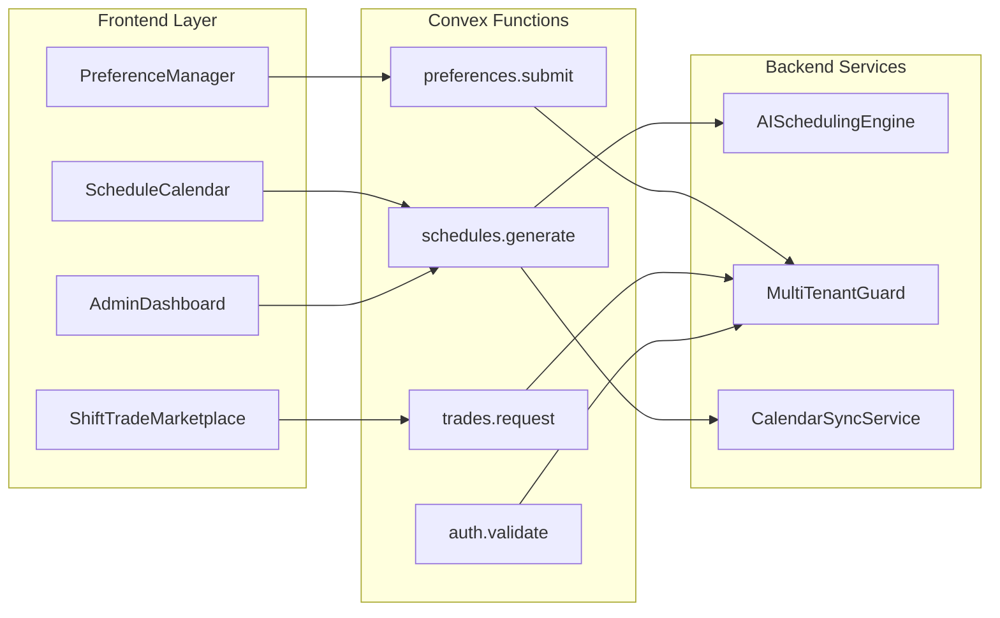

# Components

## Frontend Components

**ScheduleCalendar**
**Responsibility:** Display monthly/weekly schedule view with shift assignments and holiday indicators

**Key Interfaces:**
- Props: `{ scheduleId: string, viewMode: 'month' | 'week', userId?: string }`
- Events: `onShiftClick`, `onDateSelect`, `onViewChange`

**Dependencies:** @tanstack/react-table, date-fns, shadcn/ui calendar

**Technology Stack:** React, TypeScript, TailwindCSS

---

**PreferenceManager**
**Responsibility:** Handle preference submission and display fulfillment analytics

**Key Interfaces:**
- Props: `{ userId: string, period: SchedulePeriod }`
- Events: `onPreferenceSubmit`, `onPreferenceDelete`

**Dependencies:** Convex mutations, shadcn/ui forms, recharts

**Technology Stack:** React Hook Form, Zod validation, Convex subscriptions

---

**ShiftTradeMarketplace**
**Responsibility:** Facilitate shift trading between staff with approval workflow

**Key Interfaces:**
- Props: `{ currentUserId: string, scheduleId: string }`
- Events: `onTradeRequest`, `onTradeAccept`, `onTradeDecline`

**Dependencies:** Real-time Convex queries, notification system

**Technology Stack:** React, Convex real-time subscriptions, shadcn/ui

## Backend Components

**AISchedulingEngine**
**Responsibility:** Interface with AI providers for constraint satisfaction scheduling

**Key Interfaces:**
- `generateSchedule(constraints: Constraints): Promise<Schedule>`
- `validateConstraints(schedule: Schedule): ValidationResult`

**Dependencies:** OpenAI/Gemini APIs, constraint validator

**Technology Stack:** TypeScript, AI provider SDKs, Convex actions

---

**MultiTenantGuard**
**Responsibility:** Ensure data isolation between organizations in all queries

**Key Interfaces:**
- `withOrgContext(handler: Function): Function`
- `validateOrgAccess(userId: string, orgId: string): boolean`

**Dependencies:** Clerk organizations, Convex auth

**Technology Stack:** Convex middleware patterns, Clerk SDK

---

**CalendarSyncService**
**Responsibility:** Bi-directional sync with Google Calendar and CalDAV

**Key Interfaces:**
- `syncToCalendar(userId: string, schedule: Schedule): Promise<void>`
- `subscribeToCalendar(calendarUrl: string): Promise<Subscription>`

**Dependencies:** Google Calendar API, CalDAV client, Convex scheduled functions

**Technology Stack:** Node.js, Google APIs, tsdav library

## Component Interaction Diagram

