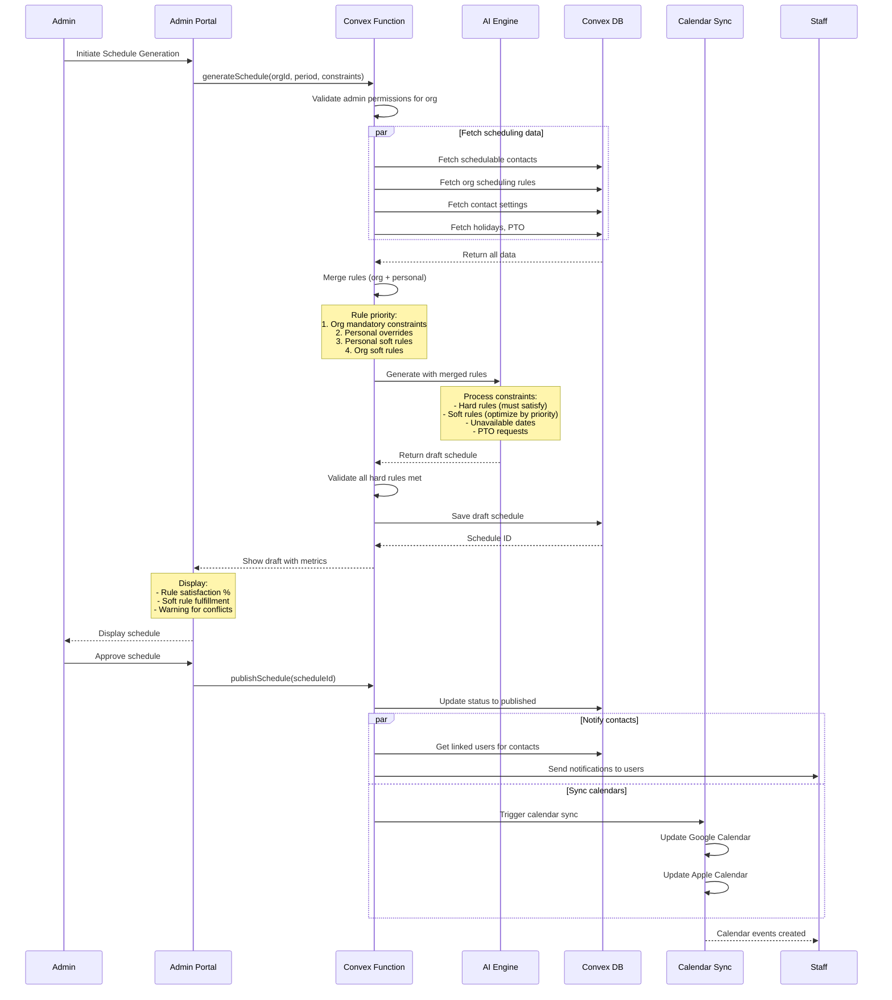
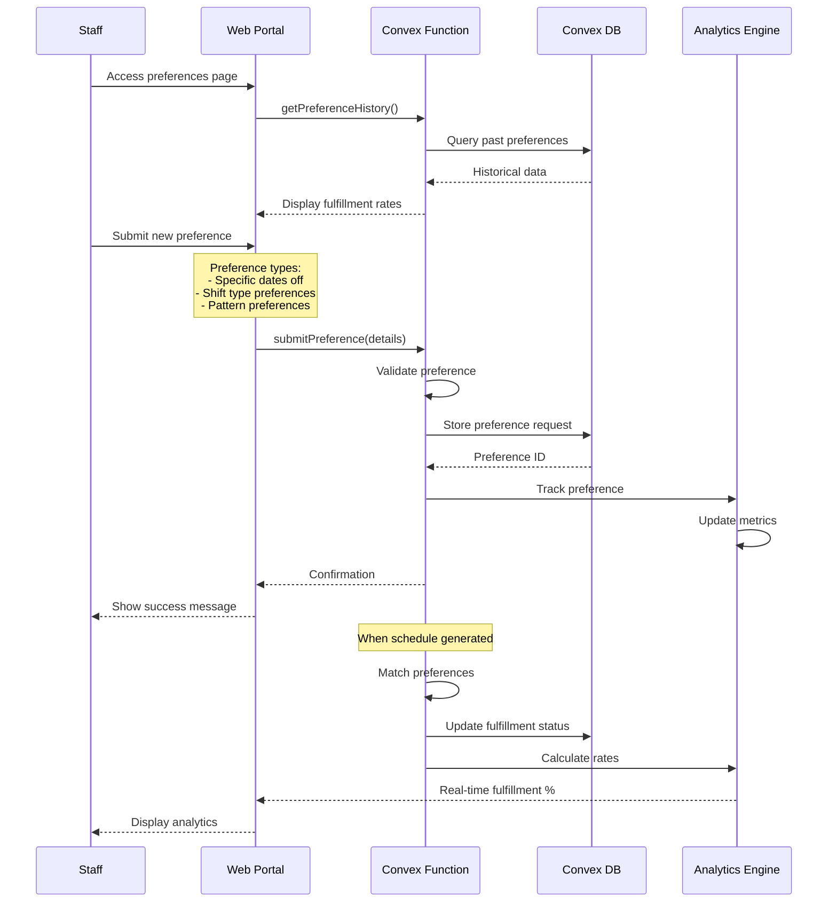
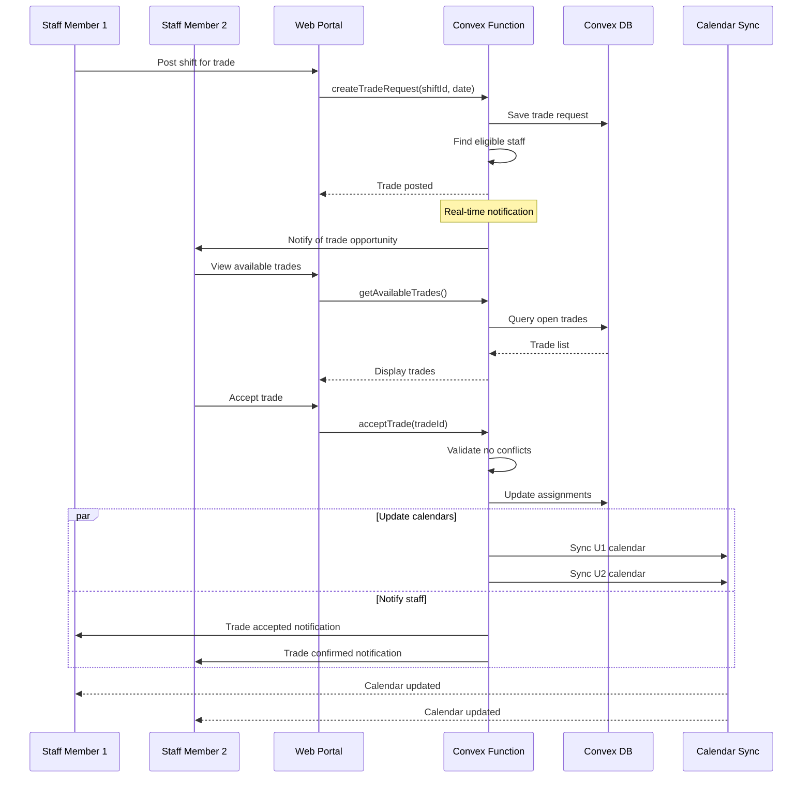
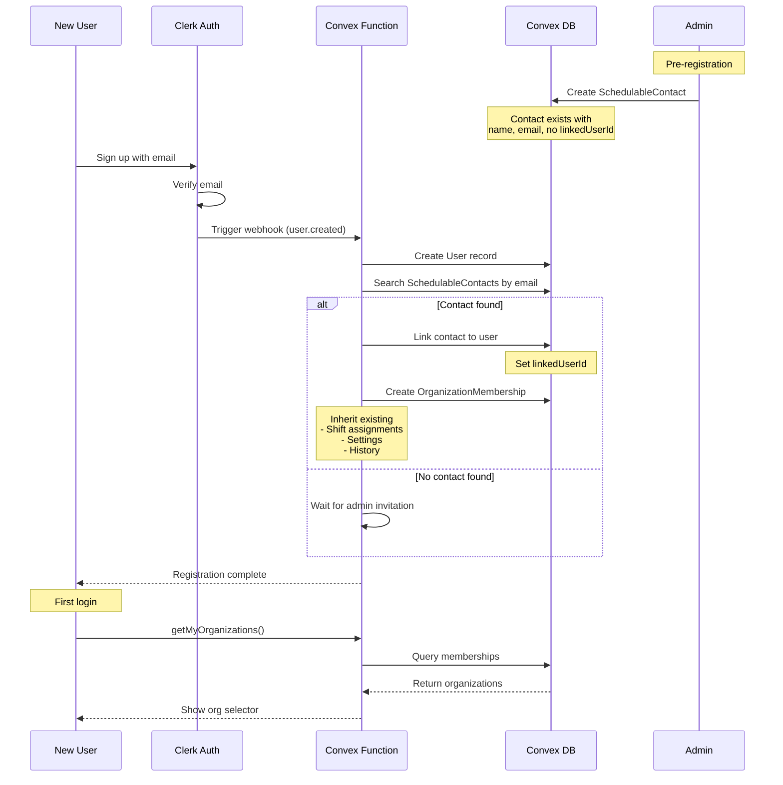
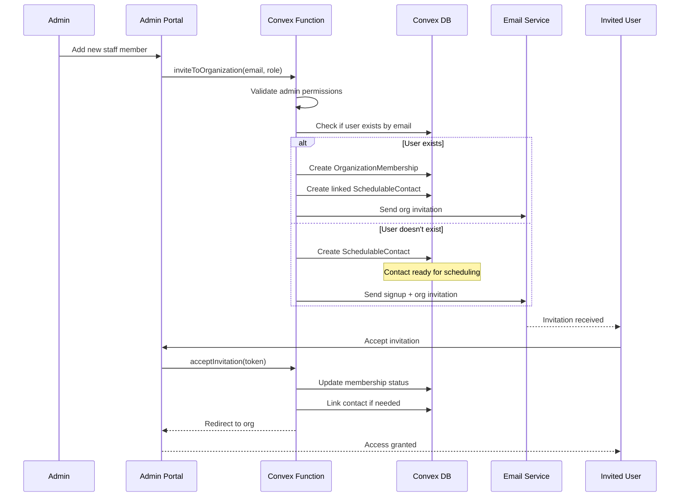

# Core Workflows

## Schedule Generation Workflow

## Preference Submission and Tracking

## Shift Trade Workflow

## User Registration and Contact Linking

## Organization Invitation Workflow

