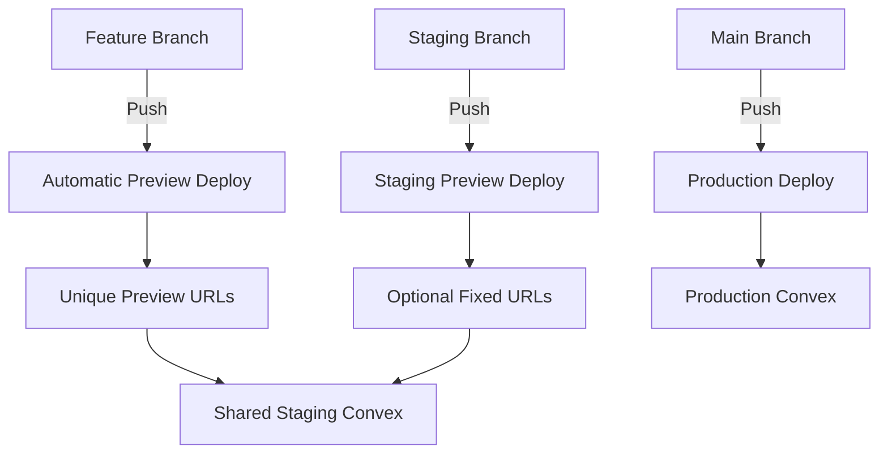

# Deployment Architecture

## Overview

VECTR0 uses a hybrid deployment architecture with **Cloudflare Pages** for frontend applications and **Convex Cloud** for backend services. This document provides comprehensive deployment instructions for all components.

## Deployment Strategy

### Frontend Applications (Cloudflare Pages)

**Three Separate Deployments:**
1. **Admin App** (`admin.vectr0.com`)
   - Platform: Cloudflare Pages
   - Build Command: `pnpm build --filter=@vectr0/admin`
   - Output Directory: `apps/admin/dist`
   
2. **Web App** (`app.vectr0.com`)
   - Platform: Cloudflare Pages  
   - Build Command: `pnpm build --filter=@vectr0/web`
   - Output Directory: `apps/web/dist`
   
3. **Marketing Site** (`www.vectr0.com`)
   - Platform: Cloudflare Pages
   - Build Command: `pnpm build --filter=@vectr0/marketing`
   - Output Directory: `apps/marketing/dist`

### Backend Services (Convex)

**Convex Deployment:**
- Platform: Convex Cloud
- Build Command: `pnpm convex deploy`
- Deployment Method: Automatic via Convex CLI
- Location: `packages/convex/`

## Cloudflare Pages Setup

### Initial Setup (One-time per app)

#### 1. Admin App Setup

```bash
# Connect repository to Cloudflare Pages
1. Go to Cloudflare Dashboard > Pages
2. Click "Create a project" > "Connect to Git"
3. Select your GitHub repository
4. Configure build settings:
   - Project name: vectr0-admin
   - Production branch: main
   - Build command: pnpm build --filter=@vectr0/admin
   - Build output directory: apps/admin/dist
   - Root directory: /
   - Node version: 20.x
```

**Environment Variables:**
```
VITE_CONVEX_URL=<your-convex-deployment-url>
VITE_CLERK_PUBLISHABLE_KEY=<clerk-key>
VITE_APP_URL=https://admin.vectr0.com
VITE_ENVIRONMENT=production
```

#### 2. Web App Setup

```bash
# Same process as Admin, with:
- Project name: vectr0-app
- Build command: pnpm build --filter=@vectr0/web
- Build output directory: apps/web/dist
```

**Environment Variables:**
```
VITE_CONVEX_URL=<your-convex-deployment-url>
VITE_CLERK_PUBLISHABLE_KEY=<clerk-key>
VITE_APP_URL=https://app.vectr0.com
VITE_ENVIRONMENT=production
```

#### 3. Marketing Site Setup

```bash
# Same process, with:
- Project name: vectr0-marketing
- Build command: pnpm build --filter=@vectr0/marketing  
- Build output directory: apps/marketing/dist
```

**Environment Variables:**
```
PUBLIC_APP_URL=https://app.vectr0.com
PUBLIC_ADMIN_URL=https://admin.vectr0.com
```

### Custom Domains Configuration

```bash
# For each Cloudflare Pages project:
1. Go to Custom domains tab
2. Add custom domain:
   - admin.vectr0.com → vectr0-admin
   - app.vectr0.com → vectr0-app
   - www.vectr0.com → vectr0-marketing
3. Update DNS records (automatic if using Cloudflare DNS)
```

## Convex Deployment

### Initial Setup

```bash
# Install Convex CLI
pnpm add -D convex

# Login to Convex
pnpm convex login

# Initialize project (one-time)
cd packages/convex
pnpm convex init

# This creates:
# - .env.local with CONVEX_DEPLOYMENT
# - convex.json with project configuration
```

### Deployment Workflow

#### Development Deployment
```bash
# Deploy to dev environment
pnpm convex dev  # Starts local dev server with hot reload
```

#### Production Deployment
```bash
# Deploy to production
pnpm convex deploy --prod

# Or with specific deployment
pnpm convex deploy --deployment production
```

### Environment Variables for Convex

```bash
# Set environment variables in Convex Dashboard
pnpm convex env set CLERK_SECRET_KEY <value> --prod
pnpm convex env set OPENAI_API_KEY <value> --prod
pnpm convex env set GOOGLE_CALENDAR_CLIENT_ID <value> --prod
pnpm convex env set GOOGLE_CALENDAR_CLIENT_SECRET <value> --prod
```

## Deployment Coordination

### When to Deploy Convex vs Frontend Apps

**Deploy Convex FIRST when:**
- Adding new database schemas
- Creating new API functions
- Modifying existing function signatures
- Updating authentication logic
- Changing data validation rules

**Deploy Frontend Apps AFTER Convex when:**
- Consuming new Convex functions
- Using updated data schemas
- Implementing UI for new features

**Can Deploy Independently:**
- UI-only changes (CSS, layout, text)
- Frontend refactoring without API changes
- Adding frontend-only features (animations, local state)
- Convex performance optimizations without API changes

### Deployment Order Best Practices

```bash
# Recommended deployment sequence for breaking changes:

1. Deploy Convex with backward compatibility
   pnpm convex deploy --prod
   
2. Verify Convex deployment
   # Check Convex Dashboard for successful deployment
   # Test functions in Convex Dashboard console
   
3. Deploy Frontend Apps (can be parallel)
   # Trigger GitHub Actions or manual Cloudflare Pages deploy
   # Admin, Web, and Marketing can deploy simultaneously
   
4. Remove deprecated Convex code (if applicable)
   # After all frontends are updated
   pnpm convex deploy --prod
```

## CI/CD Pipeline

VECTR0 uses a **tag-based production deployment** strategy for controlled, stable releases:

- **Staging**: Automatic deployment on push to `main` branch
- **Production**: Manual deployment via semantic version tags (`v*.*.*`)

### GitHub Actions Workflows

#### Convex Deployment Workflow

```yaml
# .github/workflows/deploy-convex.yaml
name: Deploy Convex

on:
  push:
    branches: [main]
    paths:
      - 'packages/convex/**'
      - 'packages/shared/**'
  workflow_dispatch:

jobs:
  deploy:
    runs-on: ubuntu-latest
    steps:
      - uses: actions/checkout@v4
      
      - uses: pnpm/action-setup@v2
        with:
          version: 8
          
      - uses: actions/setup-node@v4
        with:
          node-version: 20
          cache: 'pnpm'
          
      - run: pnpm install --frozen-lockfile
      
      - name: Deploy to Convex
        run: pnpm convex deploy --prod
        env:
          CONVEX_DEPLOY_KEY: ${{ secrets.CONVEX_DEPLOY_KEY }}
```

#### Frontend Deployment Workflows

```yaml
# .github/workflows/deploy-admin.yaml  
name: Deploy Admin App

on:
  push:
    branches: [main]
    paths:
      - 'apps/admin/**'
      - 'packages/ui/**'
      - 'packages/shared/**'
  workflow_dispatch:

jobs:
  deploy:
    runs-on: ubuntu-latest
    steps:
      - uses: actions/checkout@v4
      
      - name: Trigger Cloudflare Pages Deploy
        run: |
          curl -X POST "https://api.cloudflare.com/client/v4/accounts/${{ secrets.CF_ACCOUNT_ID }}/pages/projects/vectr0-admin/deployments" \
            -H "Authorization: Bearer ${{ secrets.CF_API_TOKEN }}" \
            -H "Content-Type: application/json" \
            -d '{"branch": "main"}'
```

### Manual Deployment Commands

#### Deploy All Frontend Apps
```bash
# From project root
pnpm deploy:admin    # Deploy admin app to Cloudflare Pages
pnpm deploy:web      # Deploy web app to Cloudflare Pages  
pnpm deploy:marketing # Deploy marketing site to Cloudflare Pages
pnpm deploy:all-frontends # Deploy all three simultaneously
```

#### Deploy Convex
```bash
# Deploy to production
pnpm convex:deploy

# Deploy with specific environment
pnpm convex deploy --deployment production

# Deploy and push schema changes
pnpm convex deploy --push
```

## Rollback Procedures

### Frontend Rollback (Cloudflare Pages)

```bash
# Via Cloudflare Dashboard:
1. Go to Pages > Your Project > Deployments
2. Find the previous working deployment
3. Click "..." menu > "Rollback to this deployment"
4. Confirm rollback

# Via API:
curl -X POST "https://api.cloudflare.com/client/v4/accounts/{account_id}/pages/projects/{project_name}/deployments/{deployment_id}/rollback" \
  -H "Authorization: Bearer {api_token}"
```

### Convex Rollback

```bash
# List recent deployments
pnpm convex dashboard

# In Convex Dashboard:
1. Go to Deployments tab
2. Find previous stable version
3. Click "Redeploy" on that version

# Via CLI (if you have the version):
pnpm convex deploy --version <previous-version>
```

## Monitoring Deployments

### Health Checks

```javascript
// packages/convex/functions/health.ts
import { query } from "./_generated/server";

export const check = query({
  handler: async () => ({
    status: "healthy",
    timestamp: Date.now(),
    version: process.env.CONVEX_DEPLOYMENT_VERSION,
  }),
});
```

### Frontend Health Endpoints

```typescript
// apps/admin/src/routes/health.tsx
export function HealthRoute() {
  const convexHealth = useQuery(api.health.check);
  
  return {
    app: "admin",
    status: convexHealth ? "healthy" : "degraded",
    convex: convexHealth,
    version: import.meta.env.VITE_APP_VERSION,
  };
}
```

## Deployment Checklist

### Pre-Deployment

- [ ] All tests passing locally
- [ ] Environment variables documented
- [ ] Database migrations prepared (if needed)
- [ ] Feature flags configured
- [ ] Rollback plan documented

### Convex Deployment

- [ ] Schema changes backward compatible
- [ ] New functions tested locally
- [ ] Environment variables set in dashboard
- [ ] Deployment successful in dashboard
- [ ] Health check passing

### Frontend Deployment  

- [ ] Build successful locally
- [ ] Environment variables set in Cloudflare
- [ ] Correct Convex URL configured
- [ ] Deployment triggered
- [ ] Custom domain working
- [ ] SSL certificate active

### Post-Deployment

- [ ] Health checks passing
- [ ] Key user flows tested
- [ ] Performance metrics normal
- [ ] Error rates acceptable
- [ ] Rollback tested (staging)

## Troubleshooting

### Common Cloudflare Pages Issues

**Build Failures:**
```bash
# Check build logs in Cloudflare Dashboard
# Common fixes:
- Ensure Node version matches local (20.x)
- Verify pnpm-lock.yaml is committed
- Check environment variables are set
- Ensure build output directory is correct
```

**Domain Issues:**
```bash
# Verify DNS records
dig admin.vectr0.com
dig app.vectr0.com

# Check SSL certificate status in Cloudflare Dashboard
```

### Common Convex Issues

**Deployment Failures:**
```bash
# Check deployment logs
pnpm convex logs --deployment production

# Verify schema matches
pnpm convex codegen

# Test functions locally first
pnpm convex dev
```

**Function Errors:**
```bash
# Monitor function logs
pnpm convex logs --function schedules:create

# Check error rates in dashboard
# Review function metrics
```

## Security Considerations

### Secrets Management

```bash
# Never commit these files:
.env
.env.local
.env.production

# Use GitHub Secrets for:
- CONVEX_DEPLOY_KEY
- CF_API_TOKEN
- CF_ACCOUNT_ID
- CLERK_SECRET_KEY

# Use Cloudflare Pages Environment Variables for:
- VITE_CONVEX_URL
- VITE_CLERK_PUBLISHABLE_KEY
- Public API endpoints

# Use Convex Environment Variables for:
- API keys
- OAuth credentials
- Database connection strings
```

### Access Control

```yaml
# Limit deployment permissions:
- Production deployments: Protected branch + manual approval
- Staging deployments: Auto-deploy from main
- Development: Local only

# Required GitHub branch protection:
- Require pull request reviews
- Dismiss stale reviews
- Require status checks
- Include administrators
```

## Staging & Preview Deployments

### Recommended Strategy: Branch-Based Preview Deployments

VECTR0 uses Cloudflare Pages' automatic preview deployments for staging environments. Every branch gets its own preview URL automatically.

### How It Works



### Preview Deployment Setup

#### 1. Convex Staging Environment (One-time)

```bash
# Create staging Convex deployment
cd packages/convex
npx convex init --deployment staging

# Deploy staging backend
pnpm convex deploy --deployment staging

# Note the staging URL: https://staging-[project].convex.cloud
```

#### 2. Cloudflare Pages Configuration

Cloudflare Pages automatically creates preview deployments for all non-production branches:

```bash
# Automatic preview URLs format:
https://[hash].[project-name].pages.dev

# Examples:
https://abc123.vectr0-admin.pages.dev     # Admin preview
https://xyz789.vectr0-app.pages.dev       # App preview
https://def456.vectr0-marketing.pages.dev # Marketing preview
```

#### 3. Environment Variable Configuration

In Cloudflare Pages Dashboard for each project:

```bash
# Production Environment (main branch)
VITE_CONVEX_URL=https://prod-[project].convex.cloud
VITE_ENVIRONMENT=production

# Preview Environment (all other branches)
VITE_CONVEX_URL=https://staging-[project].convex.cloud
VITE_ENVIRONMENT=staging
```

### Development Workflow

#### Feature Development

```bash
# 1. Create feature branch
git checkout -b feature/new-schedule-ui

# 2. Make changes and push
git add .
git commit -m "Add new schedule UI"
git push origin feature/new-schedule-ui

# 3. Automatic preview deployment triggered
# Check GitHub PR for preview URLs
# Or find in Cloudflare Pages Dashboard > Deployments

# 4. Test with staging Convex backend
# All preview deployments share the staging Convex instance
```

#### Optional: Fixed Staging URLs

For QA teams or external stakeholders who need consistent URLs:

```bash
# 1. Create long-lived staging branch
git checkout -b staging
git push origin staging

# 2. Configure custom domains (optional)
# In Cloudflare Pages > Custom domains:
staging-admin.vectr0.com → staging branch
staging-app.vectr0.com → staging branch
staging.vectr0.com → staging branch
```

### Deployment Promotion Path

```
1. Feature Branch → Preview URL → Development Testing
        ↓
2. Pull Request → Preview URL → Code Review
        ↓
3. Staging Branch → Staging URLs → QA Testing (optional)
        ↓
4. Main Branch → Production → Release
```

### Managing Staging Data

```bash
# Seed staging Convex with test data
cd packages/convex
NODE_ENV=staging pnpm seed:staging

# Clear staging data
pnpm convex run --deployment staging utils:clearAllData

# Copy production schema to staging
pnpm convex deploy --deployment staging --sync-schema
```

### Preview Deployment Features

| Feature | Benefit |
|---------|--------|
| **Automatic Deployment** | Every branch push triggers deployment |
| **Unique URLs** | No conflicts between developers |
| **Shared Staging Backend** | Cost-effective, single Convex instance |
| **Environment Isolation** | Separate from production |
| **Automatic Cleanup** | Deleted when branch is deleted |
| **PR Integration** | Preview links in GitHub PRs |

### Best Practices

1. **Use descriptive branch names** for easier identification:
   - `feature/user-authentication`
   - `fix/schedule-overlap`
   - `test/performance-improvements`

2. **Share preview URLs** in PR descriptions:
   ```markdown
   ## Preview URLs
   - Admin: https://abc123.vectr0-admin.pages.dev
   - App: https://xyz789.vectr0-app.pages.dev
   ```

3. **Keep staging Convex data clean**:
   - Regular data resets
   - Automated cleanup scripts
   - Test data seeders

4. **Monitor staging costs**:
   - Single staging Convex instance
   - Cloudflare Pages preview deployments are free
   - Delete old preview deployments if needed

### GitHub Actions for Staging

```yaml
# .github/workflows/deploy-staging-convex.yaml
name: Deploy Staging Convex

on:
  push:
    branches: 
      - staging
      - 'feature/**'
      - 'fix/**'
    paths:
      - 'packages/convex/**'
      - 'packages/shared/**'

jobs:
  deploy-staging:
    runs-on: ubuntu-latest
    steps:
      - uses: actions/checkout@v4
      - uses: pnpm/action-setup@v2
        with:
          version: 8
      - uses: actions/setup-node@v4
        with:
          node-version: 20
          cache: 'pnpm'
      - run: pnpm install --frozen-lockfile
      - name: Deploy to Staging Convex
        run: pnpm convex deploy --deployment staging
        env:
          CONVEX_DEPLOY_KEY: ${{ secrets.CONVEX_DEPLOY_KEY_STAGING }}
```

### Preview Deployment Notifications

```yaml