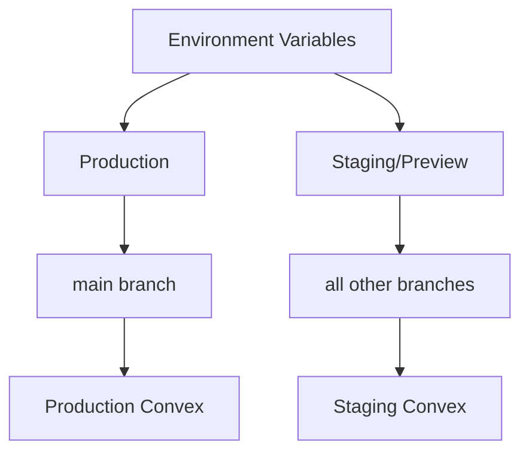

# Environment Variables Configuration Guide

## Overview

VECTR0 uses a hierarchical environment variable system that supports production, staging, and preview deployments with proper isolation.

## Environment Hierarchy



## Cloudflare Pages Configuration

### Setting Environment Variables

1. Navigate to **Cloudflare Dashboard** → **Pages** → **Your Project**
2. Go to **Settings** → **Environment variables**
3. Configure for each environment:

### Production Environment Variables

Applied to: `main` branch only

#### Admin App (admin.vectr0.com)

```bash
# Production Environment
VITE_CONVEX_URL=https://proud-shark-123.convex.cloud
VITE_CLERK_PUBLISHABLE_KEY=pk_live_xxxxxxxxxxxxx
VITE_APP_URL=https://admin.vectr0.com
VITE_ENVIRONMENT=production
VITE_REQUIRE_ROLE=admin                       # ⚠️ IMPORTANT: Enforces admin-only access
VITE_REDIRECT_NON_ADMIN=https://app.vectr0.com # Redirect URL for non-admin users
VITE_SENTRY_DSN=https://xxxxx@sentry.io/xxxxx  # Optional
VITE_POSTHOG_KEY=phc_xxxxxxxxxxxxx            # Optional
```

#### Web App (app.vectr0.com)

```bash
# Production Environment
VITE_CONVEX_URL=https://proud-shark-123.convex.cloud
VITE_CLERK_PUBLISHABLE_KEY=pk_live_xxxxxxxxxxxxx
VITE_APP_URL=https://app.vectr0.com
VITE_ENVIRONMENT=production
VITE_GOOGLE_CALENDAR_CLIENT_ID=xxxxx.apps.googleusercontent.com
VITE_SENTRY_DSN=https://xxxxx@sentry.io/xxxxx  # Optional
VITE_POSTHOG_KEY=phc_xxxxxxxxxxxxx            # Optional
```

#### Marketing Site (www.vectr0.com)

```bash
# Production Environment
PUBLIC_APP_URL=https://app.vectr0.com
PUBLIC_ADMIN_URL=https://admin.vectr0.com
PUBLIC_MARKETING_URL=https://www.vectr0.com
PUBLIC_ENVIRONMENT=production
PUBLIC_POSTHOG_KEY=phc_xxxxxxxxxxxxx  # Optional
```

### Preview Environment Variables

Applied to: ALL branches except `main`

#### Admin App Preview

```bash
# Preview Environment (all non-main branches)
VITE_CONVEX_URL=https://staging-shark-456.convex.cloud
VITE_CLERK_PUBLISHABLE_KEY=pk_test_xxxxxxxxxxxxx
VITE_APP_URL=https://staging-admin.vectr0.com  # Or use preview URL
VITE_ENVIRONMENT=staging
VITE_ENABLE_DEBUG=true  # Optional: Enable debug features
```

#### Web App Preview

```bash
# Preview Environment
VITE_CONVEX_URL=https://staging-shark-456.convex.cloud
VITE_CLERK_PUBLISHABLE_KEY=pk_test_xxxxxxxxxxxxx
VITE_APP_URL=https://staging-app.vectr0.com  # Or use preview URL
VITE_ENVIRONMENT=staging
VITE_GOOGLE_CALENDAR_CLIENT_ID=xxxxx.apps.googleusercontent.com  # Test credentials
VITE_ENABLE_DEBUG=true
```

#### Marketing Site Preview

```bash
# Preview Environment
PUBLIC_APP_URL=https://staging-app.vectr0.com
PUBLIC_ADMIN_URL=https://staging-admin.vectr0.com
PUBLIC_MARKETING_URL=https://staging.vectr0.com
PUBLIC_ENVIRONMENT=staging
```

## Convex Environment Variables

### Production Deployment

Set in Convex Dashboard → Production Deployment → Settings → Environment Variables:

```bash
# Authentication
CLERK_SECRET_KEY=sk_live_xxxxxxxxxxxxx
CLERK_WEBHOOK_SECRET=whsec_xxxxxxxxxxxxx

# External APIs
OPENAI_API_KEY=sk-xxxxxxxxxxxxx
GOOGLE_CALENDAR_CLIENT_SECRET=xxxxxxxxxxxxx
SENDGRID_API_KEY=SG.xxxxxxxxxxxxx

# Monitoring (Optional)
SENTRY_DSN=https://xxxxx@sentry.io/xxxxx
LOGTAIL_TOKEN=xxxxxxxxxxxxx

# Feature Flags
ENABLE_AI_SCHEDULING=true
ENABLE_CALENDAR_SYNC=true
```

### Staging Deployment

Set in Convex Dashboard → Staging Deployment → Settings → Environment Variables:

```bash
# Authentication (Test Keys)
CLERK_SECRET_KEY=sk_test_xxxxxxxxxxxxx
CLERK_WEBHOOK_SECRET=whsec_test_xxxxxxxxxxxxx

# External APIs (Test/Limited Keys)
OPENAI_API_KEY=sk-test-xxxxxxxxxxxxx  # Limited quota
GOOGLE_CALENDAR_CLIENT_SECRET=xxxxxxxxxxxxx  # Test app
SENDGRID_API_KEY=SG.test.xxxxxxxxxxxxx  # Sandbox mode

# Monitoring
ENABLE_DEBUG_LOGGING=true

# Feature Flags
ENABLE_AI_SCHEDULING=true
ENABLE_CALENDAR_SYNC=false  # Disabled for staging
ENABLE_TEST_MODE=true
```

## GitHub Actions Secrets

Set in GitHub → Settings → Secrets and variables → Actions:

### Repository Secrets

```bash
# Cloudflare
CF_API_TOKEN=xxxxxxxxxxxxx              # Global API token
CF_ACCOUNT_ID=xxxxxxxxxxxxx             # Account identifier

# Convex
CONVEX_DEPLOY_KEY=xxxxxxxxxxxxx         # Production deploy key
CONVEX_DEPLOY_KEY_STAGING=xxxxxxxxxxxxx # Staging deploy key

# Clerk (for backend operations)
CLERK_SECRET_KEY=sk_live_xxxxxxxxxxxxx
CLERK_SECRET_KEY_STAGING=sk_test_xxxxxxxxxxxxx
```

## Local Development Setup

### Root `.env.example`

```bash
# Copy to .env.local for local development
# DO NOT COMMIT .env files

# Convex (Local Development)
CONVEX_DEPLOYMENT=dev
VITE_CONVEX_URL=http://localhost:3210

# Clerk Auth
VITE_CLERK_PUBLISHABLE_KEY=pk_test_xxxxxxxxxxxxx
CLERK_SECRET_KEY=sk_test_xxxxxxxxxxxxx

# Development URLs
VITE_APP_URL=http://localhost:3000
VITE_ADMIN_URL=http://localhost:3001
VITE_MARKETING_URL=http://localhost:3002

# Environment
VITE_ENVIRONMENT=development
VITE_ENABLE_DEBUG=true
```

### App-Specific `.env.local`

#### apps/admin/.env.local

```bash
VITE_CONVEX_URL=http://localhost:3210
VITE_CLERK_PUBLISHABLE_KEY=pk_test_xxxxxxxxxxxxx
VITE_APP_URL=http://localhost:3001
VITE_ENVIRONMENT=development
```

#### apps/web/.env.local

```bash
VITE_CONVEX_URL=http://localhost:3210
VITE_CLERK_PUBLISHABLE_KEY=pk_test_xxxxxxxxxxxxx
VITE_APP_URL=http://localhost:3000
VITE_ENVIRONMENT=development
```

## Environment Variable Usage

### In Frontend Code (Vite)

```typescript
// Access environment variables
const convexUrl = import.meta.env.VITE_CONVEX_URL;
const environment = import.meta.env.VITE_ENVIRONMENT;
const isProduction = environment === 'production';

// Type-safe environment variables
interface ImportMetaEnv {
  readonly VITE_CONVEX_URL: string;
  readonly VITE_CLERK_PUBLISHABLE_KEY: string;
  readonly VITE_APP_URL: string;
  readonly VITE_ENVIRONMENT: 'development' | 'staging' | 'production';
}
```

### In Convex Functions

```typescript
// packages/convex/functions/example.ts
import { action } from "./_generated/server";

export const sendEmail = action({
  handler: async (ctx) => {
    const apiKey = process.env.SENDGRID_API_KEY;
    const isProduction = process.env.CONVEX_DEPLOYMENT === 'production';
    
    if (!apiKey) {
      throw new Error("SENDGRID_API_KEY not configured");
    }
    
    // Use test mode in non-production
    const testMode = !isProduction;
    
    // Send email...
  },
});
```

### In Astro (Marketing Site)

```astro
---
// Access public environment variables
const appUrl = import.meta.env.PUBLIC_APP_URL;
const environment = import.meta.env.PUBLIC_ENVIRONMENT;
---

<a href={appUrl}>Launch App</a>
```

## Security Best Practices

### Do's ✅

1. **Use separate keys for each environment**
   - Production: `pk_live_`, `sk_live_`
   - Staging/Dev: `pk_test_`, `sk_test_`

2. **Prefix public variables appropriately**
   - Vite: `VITE_` prefix for client-side
   - Astro: `PUBLIC_` prefix for client-side
   - No prefix for server-side only

3. **Rotate keys regularly**
   - Set up key rotation schedule
   - Use expiring tokens where possible

4. **Limit staging/preview access**
   - Use restricted API keys
   - Lower rate limits
   - Sandbox modes

### Don'ts ❌

1. **Never commit `.env` files**
   ```bash
   # .gitignore
   .env
   .env.local
   .env.production
   .env.*.local
   ```

2. **Never expose secret keys to client**
   - Wrong: `VITE_STRIPE_SECRET_KEY`
   - Right: `VITE_STRIPE_PUBLISHABLE_KEY`

3. **Never use production keys in development**
   - Always use test/development keys locally
   - Separate staging credentials

4. **Never log sensitive values**
   ```typescript
   // Bad
   console.log('API Key:', process.env.API_KEY);
   
   // Good
   console.log('API Key configured:', !!process.env.API_KEY);
   ```

## Troubleshooting

### Variable Not Available

1. **Check environment in Cloudflare Pages**
   - Ensure variable is set for correct environment
   - Production vs Preview settings

2. **Verify branch configuration**
   - Production: `main` branch only
   - Preview: All other branches

3. **Check variable prefix**
   - Vite apps: Must start with `VITE_`
   - Astro: Must start with `PUBLIC_`

### Deployment Failures

```bash
# Verify environment variables locally
pnpm build --mode staging

# Check Cloudflare Pages build logs
# Look for "Environment variables loaded" message

# Test Convex environment variables
pnpm convex env list --deployment staging
```

### Different Values Between Environments

Use environment-specific config files:

```typescript
// config/environment.ts
export const config = {
  development: {
    apiUrl: 'http://localhost:3210',
    debug: true,
  },
  staging: {
    apiUrl: 'https://staging.convex.cloud',
    debug: true,
  },
  production: {
    apiUrl: 'https://prod.convex.cloud',
    debug: false,
  },
}[import.meta.env.VITE_ENVIRONMENT || 'development'];
```

## Migration Checklist

When adding new environment variables:

- [ ] Add to `.env.example` with description
- [ ] Add to Cloudflare Pages (Production environment)
- [ ] Add to Cloudflare Pages (Preview environment)
- [ ] Add to Convex Dashboard (if backend)
- [ ] Add to GitHub Secrets (if needed for CI/CD)
- [ ] Document in this guide
- [ ] Update TypeScript types
- [ ] Test in preview deployment
- [ ] Verify in production deployment