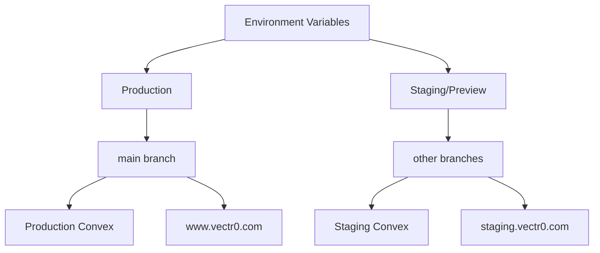

# Environment Variables Configuration Guide

## Overview

VECTR0 uses a simplified environment variable system for the single TanStack Start web application with proper separation between public (client-side) and server-only variables.

## Environment Architecture



## Variable Types in TanStack Start

### Public Variables
- Prefixed with `VITE_`
- Available in browser and server-side code
- Included in client bundle
- Used for non-sensitive configuration

### Server Variables
- No prefix required
- Only available in server-side code (SSR, loaders, actions)
- Never sent to browser
- Used for secrets and sensitive data

## Cloudflare Pages Configuration

### Setting Environment Variables

1. Navigate to **Cloudflare Dashboard** → **Pages** → **vectr0**
2. Go to **Settings** → **Environment variables**
3. Configure for each environment:

### Production Environment Variables

Applied to: `main` branch deployments → `www.vectr0.com`

```bash
# === PUBLIC VARIABLES (Client + Server) ===
VITE_CONVEX_URL=https://proud-shark-123.convex.cloud
VITE_CLERK_PUBLISHABLE_KEY=pk_live_xxxxxxxxxxxxx
VITE_APP_URL=https://www.vectr0.com
VITE_ENVIRONMENT=production

# Optional Analytics
VITE_SENTRY_DSN=https://xxxxx@sentry.io/xxxxx
VITE_POSTHOG_KEY=phc_xxxxxxxxxxxxx
VITE_GOOGLE_ANALYTICS_ID=G-XXXXXXXXXX

# === SERVER-ONLY VARIABLES (Never sent to browser) ===
CLERK_SECRET_KEY=sk_live_xxxxxxxxxxxxx
CLERK_WEBHOOK_SECRET=whsec_xxxxxxxxxxxxx
CONVEX_DEPLOY_KEY=prod:xxxxxxxxxxxxx

# External API Keys (server-only)
OPENAI_API_KEY=sk-xxxxxxxxxxxxx
UPLOADTHING_SECRET=sk_live_xxxxxxxxxxxxx
UPLOADTHING_APP_ID=xxxxxxx
GOOGLE_CALENDAR_CLIENT_SECRET=xxxxxxxxxxxxx

# Optional server secrets
SENTRY_AUTH_TOKEN=xxxxxxxxxxxxx
```

### Preview Environment Variables

Applied to: ALL branches except `main` → `staging.vectr0.com` or preview URLs

```bash
# === PUBLIC VARIABLES (Client + Server) ===
VITE_CONVEX_URL=https://staging-shark-456.convex.cloud
VITE_CLERK_PUBLISHABLE_KEY=pk_test_xxxxxxxxxxxxx
VITE_APP_URL=https://staging.vectr0.com
VITE_ENVIRONMENT=staging

# Debug features for staging
VITE_ENABLE_DEBUG=true
VITE_SHOW_DEV_TOOLS=true

# === SERVER-ONLY VARIABLES ===
CLERK_SECRET_KEY=sk_test_xxxxxxxxxxxxx
CLERK_WEBHOOK_SECRET=whsec_test_xxxxxxxxxxxxx
CONVEX_DEPLOY_KEY=dev:xxxxxxxxxxxxx

# Test API Keys
OPENAI_API_KEY=sk-test-xxxxxxxxxxxxx
UPLOADTHING_SECRET=sk_test_xxxxxxxxxxxxx
UPLOADTHING_APP_ID=test_xxxxxxx
GOOGLE_CALENDAR_CLIENT_SECRET=test_xxxxxxxxxxxxx
```

## Convex Environment Variables

Set in Convex Dashboard or via CLI for backend functions:

### Production Convex Environment
```bash
# Authentication
CLERK_WEBHOOK_SECRET=whsec_xxxxxxxxxxxxx

# AI Services
OPENAI_API_KEY=sk-xxxxxxxxxxxxx
ANTHROPIC_API_KEY=sk-ant-xxxxxxxxxxxxx  # Optional: Claude API

# External Integrations
UPLOADTHING_SECRET=sk_live_xxxxxxxxxxxxx
GOOGLE_CALENDAR_CLIENT_ID=xxxxx.apps.googleusercontent.com
GOOGLE_CALENDAR_CLIENT_SECRET=xxxxxxxxxxxxx

# Email Services (Optional)
RESEND_API_KEY=re_xxxxxxxxxxxxx
SENDGRID_API_KEY=SG.xxxxxxxxxxxxx

# Monitoring
SENTRY_DSN=https://xxxxx@sentry.io/xxxxx
```

### Staging Convex Environment
```bash
# Authentication (test keys)
CLERK_WEBHOOK_SECRET=whsec_test_xxxxxxxxxxxxx

# AI Services (test/development keys)
OPENAI_API_KEY=sk-test-xxxxxxxxxxxxx
ANTHROPIC_API_KEY=sk-ant-test-xxxxxxxxxxxxx

# External Integrations (test keys)
UPLOADTHING_SECRET=sk_test_xxxxxxxxxxxxx
GOOGLE_CALENDAR_CLIENT_ID=test-xxxxx.apps.googleusercontent.com
GOOGLE_CALENDAR_CLIENT_SECRET=test_xxxxxxxxxxxxx

# Enable debug logging
DEBUG=true
LOG_LEVEL=debug
```

## Local Development Environment

### Root .env.example
```bash
# Copy this to .env.local and fill in your values

# === CONVEX ===
CONVEX_DEPLOYMENT=dev:your-dev-deployment-name
CONVEX_URL=https://your-dev-project.convex.cloud

# === CLOUDFLARE ===
CF_ACCOUNT_ID=your-cloudflare-account-id
CF_API_TOKEN=your-cloudflare-api-token

# === CLERK AUTH ===
VITE_CLERK_PUBLISHABLE_KEY=pk_test_xxxxxxxxxxxxx
CLERK_SECRET_KEY=sk_test_xxxxxxxxxxxxx
CLERK_WEBHOOK_SECRET=whsec_test_xxxxxxxxxxxxx

# === APP CONFIGURATION ===
VITE_APP_URL=http://localhost:3000
VITE_ENVIRONMENT=development

# === EXTERNAL SERVICES ===
OPENAI_API_KEY=sk-xxxxxxxxxxxxx
UPLOADTHING_SECRET=sk_test_xxxxxxxxxxxxx
UPLOADTHING_APP_ID=test_xxxxxxx

# === CALENDAR INTEGRATION ===
GOOGLE_CALENDAR_CLIENT_ID=xxxxx.apps.googleusercontent.com
GOOGLE_CALENDAR_CLIENT_SECRET=xxxxxxxxxxxxx

# === OPTIONAL SERVICES ===
SENTRY_DSN=https://xxxxx@sentry.io/xxxxx
POSTHOG_KEY=phc_xxxxxxxxxxxxx
RESEND_API_KEY=re_xxxxxxxxxxxxx
```

### apps/web/.env.local (Development)
```bash
# TanStack Start Public Variables (available in browser)
VITE_CONVEX_URL=https://your-dev-project.convex.cloud
VITE_CLERK_PUBLISHABLE_KEY=pk_test_xxxxxxxxxxxxx
VITE_APP_URL=http://localhost:3000
VITE_ENVIRONMENT=development
VITE_ENABLE_DEBUG=true

# Server-only Variables (SSR/loaders/actions)
CLERK_SECRET_KEY=sk_test_xxxxxxxxxxxxx
CONVEX_DEPLOY_KEY=dev:xxxxxxxxxxxxx
```

### packages/convex/.env.local
```bash
# Convex-specific environment variables
CLERK_WEBHOOK_SECRET=whsec_test_xxxxxxxxxxxxx
OPENAI_API_KEY=sk-xxxxxxxxxxxxx
UPLOADTHING_SECRET=sk_test_xxxxxxxxxxxxx
GOOGLE_CALENDAR_CLIENT_ID=xxxxx.apps.googleusercontent.com
GOOGLE_CALENDAR_CLIENT_SECRET=xxxxxxxxxxxxx

# Development settings
DEBUG=true
LOG_LEVEL=debug
```

## Setting Environment Variables

### Via Cloudflare Dashboard

1. **Production Variables:**
   ```bash
   # Go to: Cloudflare Dashboard → Pages → vectr0 → Settings → Environment variables
   # Set "Production (main branch)"
   PUBLIC_CONVEX_URL=https://prod.convex.cloud
   CLERK_SECRET_KEY=sk_live_xxx  # (encrypted automatically)
   ```

2. **Preview Variables:**
   ```bash
   # Set "Preview (All other branches)"
   PUBLIC_CONVEX_URL=https://staging.convex.cloud
   CLERK_SECRET_KEY=sk_test_xxx  # (encrypted automatically)
   ```

### Via Convex CLI

```bash
# Set production environment variables
cd packages/convex
pnpm convex env set CLERK_WEBHOOK_SECRET "whsec_xxxxx" --prod
pnpm convex env set OPENAI_API_KEY "sk-xxxxx" --prod

# Set development environment variables  
pnpm convex env set CLERK_WEBHOOK_SECRET "whsec_test_xxxxx"
pnpm convex env set OPENAI_API_KEY "sk-test-xxxxx"

# List all environment variables
pnpm convex env list --prod
pnpm convex env list
```

### Via Wrangler CLI

```bash
# Deploy with environment variables
wrangler pages deploy apps/web/dist \
  --project-name=vectr0 \
  --env=production

# Set individual variables
wrangler pages secret put CLERK_SECRET_KEY --project-name=vectr0
```

## Security Best Practices

### 1. **Never Commit Secrets**
```bash
# Always in .gitignore
.env.local
.env.*.local
*.env
```

### 2. **Use Different Keys Per Environment**
- **Production:** `pk_live_`, `sk_live_`, `whsec_`
- **Development:** `pk_test_`, `sk_test_`, `whsec_test_`
- **Staging:** Separate test keys, never production

### 3. **Rotate Keys Regularly**
```bash
# Monthly rotation recommended for production
# Immediately after team member changes
# After any suspected compromise
```

### 4. **Limit Permissions**
- Convex: Environment-specific deployments
- Clerk: Separate applications for prod/test
- External APIs: Use least-privilege API keys

## Environment Variable Validation

### Runtime Validation (TanStack Start)
```typescript
// apps/web/app/utils/env.ts
import { z } from 'zod';

const envSchema = z.object({
  // Public variables (validated on client + server)
  VITE_CONVEX_URL: z.string().url(),
  VITE_CLERK_PUBLISHABLE_KEY: z.string().startsWith('pk_'),
  VITE_APP_URL: z.string().url(),
  VITE_ENVIRONMENT: z.enum(['development', 'staging', 'production']),
  
  // Server-only variables (only validated on server)
  CLERK_SECRET_KEY: z.string().startsWith('sk_').optional(),
  CONVEX_DEPLOY_KEY: z.string().optional(),
});

export const env = envSchema.parse({
  VITE_CONVEX_URL: import.meta.env.VITE_CONVEX_URL,
  VITE_CLERK_PUBLISHABLE_KEY: import.meta.env.VITE_CLERK_PUBLISHABLE_KEY,
  VITE_APP_URL: import.meta.env.VITE_APP_URL,
  VITE_ENVIRONMENT: import.meta.env.VITE_ENVIRONMENT,
  // Server vars only available in server context
  ...(typeof window === 'undefined' && {
    CLERK_SECRET_KEY: process.env.CLERK_SECRET_KEY,
    CONVEX_DEPLOY_KEY: process.env.CONVEX_DEPLOY_KEY,
  }),
});
```

### Convex Validation
```typescript
// packages/convex/lib/env.ts
const requiredEnvVars = [
  'CLERK_WEBHOOK_SECRET',
  'OPENAI_API_KEY',
] as const;

export function validateEnv() {
  for (const envVar of requiredEnvVars) {
    if (!process.env[envVar]) {
      throw new Error(`Missing required environment variable: ${envVar}`);
    }
  }
}
```

## Troubleshooting

### Common Issues

1. **Variables Not Available in Browser**
   ```bash
   # ❌ Wrong - not prefixed with VITE_
   CONVEX_URL=https://...
   
   # ✅ Correct - prefixed for client access
   VITE_CONVEX_URL=https://...
   ```

2. **Secrets Exposed to Client**
   ```bash
   # ❌ Wrong - secret exposed to browser
   VITE_CLERK_SECRET_KEY=sk_live_xxx
   
   # ✅ Correct - server-only
   CLERK_SECRET_KEY=sk_live_xxx
   ```

3. **Environment Mismatch**
   ```bash
   # Ensure matching environments:
   # Cloudflare: production convex URL
   # Convex: production deployment
   # Clerk: production application
   ```

### Debug Commands

```bash
# Check Cloudflare Pages environment
wrangler pages deployment list --project-name=vectr0

# Check Convex environment
cd packages/convex
pnpm convex env list --prod

# Test local environment
pnpm dev:web  # Should show any missing variables
```

## Migration Guide

### From Three Apps to Single App

1. **Consolidate Variables:**
   ```bash
   # Before: apps/admin/.env, apps/web/.env, apps/marketing/.env
   # After: apps/web/.env (single file)
   ```

2. **Update Cloudflare Projects:**
   ```bash
   # Remove old projects: vectr0-admin, vectr0-app, vectr0-marketing  
   # Use single project: vectr0
   ```

3. **Merge Environment Settings:**
   ```bash
   # Combine all PUBLIC_ variables from three apps
   # Keep only one set of server secrets
   # Use single domain configuration
   ```

The simplified environment setup reduces complexity while maintaining security and proper separation of concerns between client and server variables.