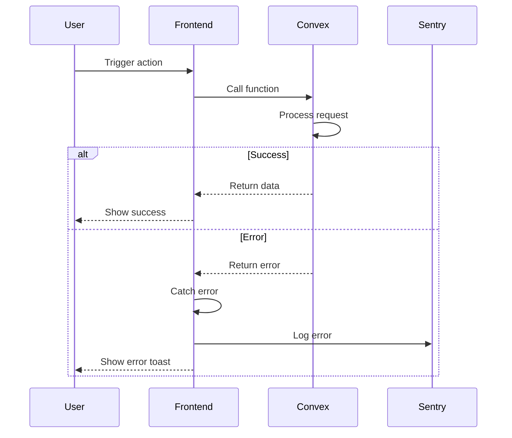

# Error Handling Strategy

## Error Flow



## Error Response Format
```typescript
interface ApiError {
  error: {
    code: string;
    message: string;
    details?: Record<string, any>;
    timestamp: string;
    requestId: string;
  };
}
```

## Frontend Error Handling
```typescript
// lib/error-handler.ts
import { toast } from 'sonner';
import * as Sentry from '@sentry/react';

export function handleError(error: unknown, context?: string) {
  const message = error instanceof Error ? error.message : 'An error occurred';
  
  // Log to Sentry
  Sentry.captureException(error, {
    tags: { context },
  });
  
  // Show user-friendly message
  toast.error(message);
  
  // Return for further handling
  return {
    error: true,
    message,
  };
}
```

## Backend Error Handling
```typescript
// lib/errors.ts
export class AppError extends Error {
  constructor(
    public code: string,
    message: string,
    public statusCode: number = 400
  ) {
    super(message);
  }
}

export function withErrorHandling<T extends (...args: any[]) => any>(fn: T): T {
  return (async (...args) => {
    try {
      return await fn(...args);
    } catch (error) {
      if (error instanceof AppError) {
        throw error;
      }
      
      console.error('Unhandled error:', error);
      throw new AppError('INTERNAL_ERROR', 'An unexpected error occurred', 500);
    }
  }) as T;
}
```
