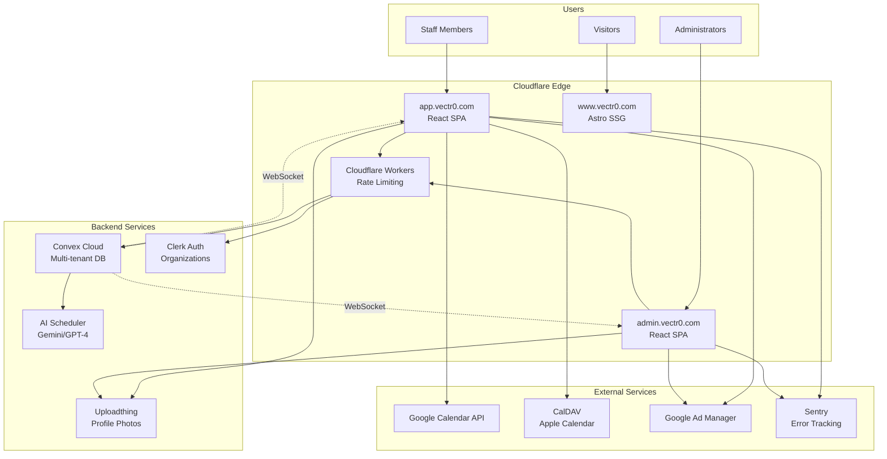

# High Level Architecture

## Technical Summary

VECTR0 employs a Jamstack architecture with React SPAs deployed on Cloudflare Pages, leveraging Convex for real-time multi-tenant backend services and Clerk for enterprise-ready authentication. The monorepo structure enables code sharing across three distinct applications (admin, staff, marketing) while maintaining independent deployment capabilities. AI-powered scheduling uses Gemini 1.5 Flash (free tier) transitioning to GPT-4o-mini for production, with comprehensive constraint satisfaction for healthcare-specific requirements. The platform achieves PRD goals through serverless scaling, real-time updates via websockets, and a sustainable advertising model using Google Ad Manager for premium healthcare audience monetization.

## Platform and Infrastructure Choice

**Platform:** Cloudflare Pages + Convex Cloud
**Key Services:** Cloudflare Pages (hosting), Convex (database/real-time), Clerk (auth), Uploadthing (images), Google Ad Manager (ads)
**Deployment Host and Regions:** Cloudflare global edge network (300+ PoPs), Convex US regions (us-west-2 primary)

## Repository Structure

**Structure:** Monorepo
**Monorepo Tool:** Turborepo with pnpm workspaces
**Package Organization:** apps/* for deployable applications, packages/* for shared libraries, single version policy

## High Level Architecture Diagram

## Architectural Patterns

- **Jamstack Architecture:** Static SPAs with serverless backend via Convex - *Rationale:* Optimal performance, infinite scalability, reduced operational overhead
- **Multi-Tenant Isolation:** Organization-based data partitioning in Convex - *Rationale:* HIPAA-ready data isolation while maintaining single codebase
- **Event-Driven Updates:** Real-time schedule changes via Convex subscriptions - *Rationale:* Instant updates across all connected clients without polling
- **Component-Based UI:** Reusable React components with TypeScript - *Rationale:* Consistency across admin and staff portals
- **Repository Pattern:** Abstract Convex queries behind service layer - *Rationale:* Testability and potential future database migration
- **BFF Pattern:** Separate API concerns for admin vs staff - *Rationale:* Optimized data fetching for different user needs
- **Constraint Satisfaction AI:** Structured prompts for schedule generation - *Rationale:* Reliable constraint handling with healthcare requirements
