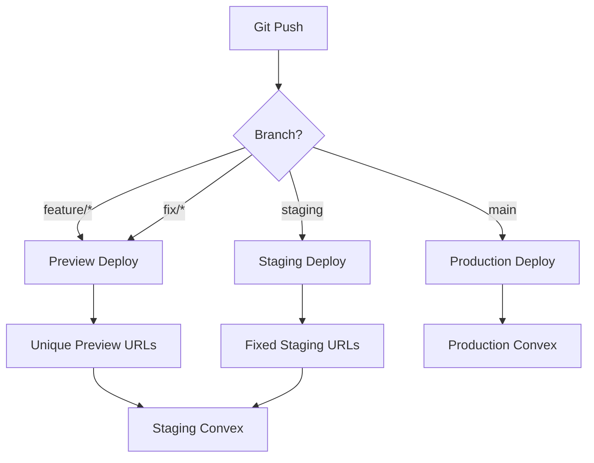
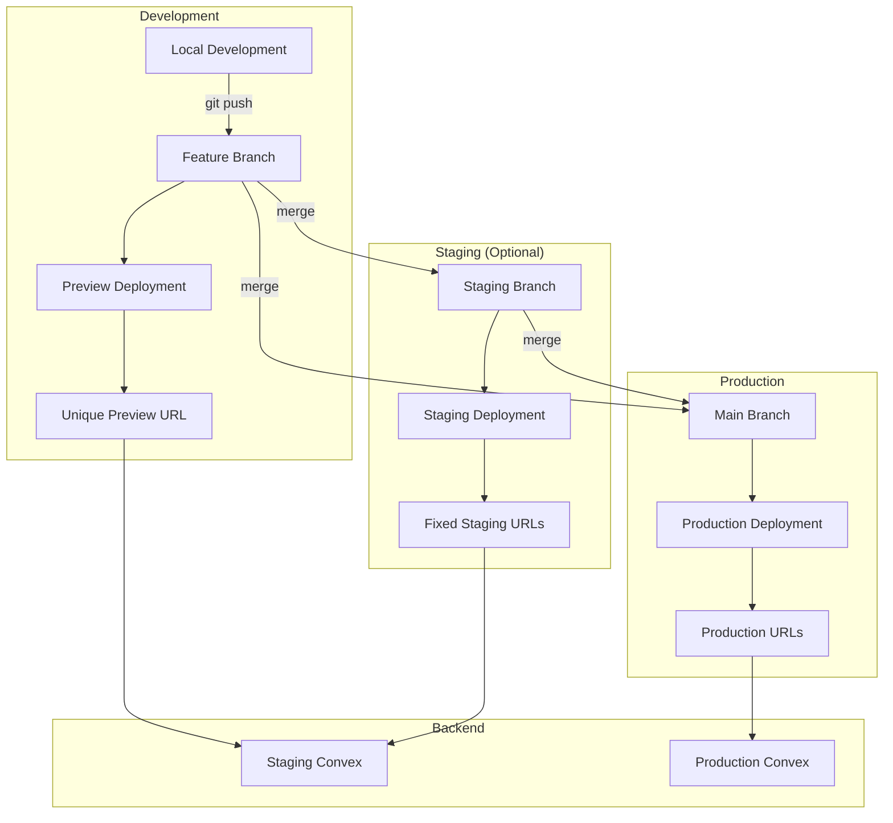

# README Deployment Sections

Add these deployment sections to the appropriate README files in your project.

## Root README.md - Main Deployment Section

```markdown
## 🚀 Deployment

VECTR0 uses a hybrid deployment architecture with **Cloudflare Pages** for frontend applications and **Convex** for backend services.

### Deployment Triggers

| Component | Trigger | Branch | Deployment Target |
|-----------|---------|---------|------------------|
| **Convex Backend** | Push to `main` with changes in `packages/convex/` | `main` | Production |
| **Admin App** | Push to `main` with changes in `apps/admin/` | `main` | admin.vectr0.com |
| **Web App** | Push to `main` with changes in `apps/web/` | `main` | app.vectr0.com |
| **Marketing Site** | Push to `main` with changes in `apps/marketing/` | `main` | www.vectr0.com |
| **All Components** | Tag push `v*.*.*` | Any | Production (Manual) |

### Automatic Deployments

Our CI/CD pipeline automatically deploys when:

1. **Pull Request Merged to `main`**: Production deployment for changed components
2. **Push to ANY other branch**: Preview deployment with unique URLs
3. **Semantic Version Tag**: Manual production release for all components



### Staging & Preview Environments

#### Automatic Preview Deployments

Every branch gets automatic preview deployments:

```bash
# Push any branch
git checkout -b feature/new-feature
git push origin feature/new-feature

# Automatic preview URLs created:
# https://[hash].vectr0-admin.pages.dev
# https://[hash].vectr0-app.pages.dev
# https://[hash].vectr0-marketing.pages.dev

# All previews use staging Convex backend
```

#### Optional Fixed Staging URLs

```bash
# Create staging branch for consistent URLs
git checkout -b staging
git push origin staging

# Configure custom domains (optional):
# staging-admin.vectr0.com
# staging-app.vectr0.com
# staging.vectr0.com
```

### Manual Ad-Hoc Deployments

#### Quick Deploy Commands

```bash
# Deploy everything
pnpm deploy:all

# Deploy specific components
pnpm deploy:convex       # Backend only
pnpm deploy:admin        # Admin app only
pnpm deploy:web          # Web app only
pnpm deploy:marketing    # Marketing site only

# Deploy frontends together (after Convex)
pnpm deploy:all-frontends
```

#### GitHub Actions Manual Trigger

1. Go to [Actions](../../actions) tab
2. Select workflow: `Deploy [Component]`
3. Click "Run workflow"
4. Select branch and confirm

#### Emergency Hotfix Process

```bash
# 1. Create hotfix branch
git checkout -b hotfix/critical-fix

# 2. Make changes and test locally
pnpm test

# 3. Push for preview deployment
git push origin hotfix/critical-fix

# 4. Test in preview environment
# Check preview URLs in GitHub PR or Cloudflare Dashboard

# 5. If approved, deploy directly to production
pnpm convex:deploy  # Deploy Convex first if needed
pnpm deploy:admin   # Deploy affected frontends

# 6. Create PR for tracking and merge to main
gh pr create --title "Hotfix: Critical issue" --body "Emergency fix deployed"
```

### Deployment Order Requirements

⚠️ **CRITICAL**: Always deploy in this order when making breaking changes:

1. **Convex Backend** (with backward compatibility)
2. **Verify Backend Health**
3. **Frontend Applications** (can be parallel)
4. **Remove deprecated backend code** (optional cleanup)

### Rollback Procedures

```bash
# Automated rollback
pnpm rollback:admin     # Rollback admin app
pnpm rollback:convex    # Rollback backend

# Manual via Cloudflare Dashboard
# 1. Go to Cloudflare Pages > Project > Deployments
# 2. Find last working deployment
# 3. Click "Rollback to this deployment"
```

### Environment Variables

#### Variable Hierarchy

| Environment | Branch | Convex URL | Purpose |
|------------|--------|------------|---------||
| **Production** | `main` | `https://prod.convex.cloud` | Live users |
| **Preview** | `feature/*`, `fix/*` | `https://staging.convex.cloud` | Development |
| **Staging** | `staging` | `https://staging.convex.cloud` | QA testing |

#### Configuration Locations

- **GitHub Secrets**: CI/CD deployment keys
- **Cloudflare Pages**: Frontend environment variables
  - Production Environment: Variables for `main` branch
  - Preview Environment: Variables for all other branches
- **Convex Dashboard**: Backend service credentials
  - Production deployment: Production secrets
  - Staging deployment: Test credentials

See [deployment documentation](docs/architecture/deployment-architecture.md) for detailed setup.
```

## apps/admin/README.md - Deployment Section

```markdown
## Deployment

This app automatically deploys to **admin.vectr0.com** when changes are pushed to `main`.

### Automatic Deployment

Triggered by:
- PR merge to `main` with changes in `apps/admin/`
- Direct push to `main` (not recommended)

### Manual Deployment

```bash
# From project root
pnpm deploy:admin

# Or directly
pnpm build --filter=@vectr0/admin
wrangler pages deploy apps/admin/dist --project-name=vectr0-admin
```

### Environment Variables

Set in Cloudflare Pages Dashboard:
- `VITE_CONVEX_URL` - Convex deployment URL
- `VITE_CLERK_PUBLISHABLE_KEY` - Clerk auth key
- `VITE_APP_URL` - https://admin.vectr0.com
- `VITE_REQUIRE_ROLE` - Set to `admin` (⚠️ Required for access control)
- `VITE_REDIRECT_NON_ADMIN` - https://app.vectr0.com

### Health Check

```bash
curl https://admin.vectr0.com/health
```
```

## apps/web/README.md - Deployment Section

```markdown
## Deployment

The web app automatically deploys to **app.vectr0.com** when changes are pushed to `main`.

### Automatic Deployment

Triggered by:
- PR merge to `main` with changes in `apps/web/`
- Direct push to `main` (not recommended)

### Manual Deployment

```bash
# From project root
pnpm deploy:web

# Or directly
pnpm build --filter=@vectr0/web
wrangler pages deploy apps/web/dist --project-name=vectr0-app
```

### Environment Variables

Set in Cloudflare Pages Dashboard:
- `VITE_CONVEX_URL` - Convex deployment URL
- `VITE_CLERK_PUBLISHABLE_KEY` - Clerk auth key
- `VITE_APP_URL` - https://app.vectr0.com

### Health Check

```bash
curl https://app.vectr0.com/health
```
```

## apps/marketing/README.md - Deployment Section

```markdown
## Deployment

This site automatically deploys to **www.vectr0.com** when changes are pushed to `main`.

### Automatic Deployment

Triggered by:
- PR merge to `main` with changes in `apps/marketing/`
- Direct push to `main` (not recommended)

### Manual Deployment

```bash
# From project root
pnpm deploy:marketing

# Or directly
pnpm build --filter=@vectr0/marketing
wrangler pages deploy apps/marketing/dist --project-name=vectr0-marketing
```

### Environment Variables

Set in Cloudflare Pages Dashboard:
- `PUBLIC_APP_URL` - https://app.vectr0.com
- `PUBLIC_ADMIN_URL` - https://admin.vectr0.com

### Health Check

```bash
curl https://www.vectr0.com/health
```
```

## packages/convex/README.md - Deployment Section

```markdown
## Deployment

Convex backend automatically deploys when changes are pushed to `main`.

### Automatic Deployment

Triggered by:
- PR merge to `main` with changes in `packages/convex/`
- Direct push to `main` (not recommended)

### Manual Deployment

```bash
# From package directory
pnpm convex deploy --prod

# From project root
pnpm convex:deploy
```

### Environment Variables

Set in Convex Dashboard:
- `CLERK_SECRET_KEY` - Clerk auth secret
- `OPENAI_API_KEY` - OpenAI API key (if using AI features)
- Other service credentials as needed

### Deployment Verification

```bash
# Check deployment status
pnpm convex dashboard

# View logs
pnpm convex logs --deployment production

# Test functions in dashboard console
```

### Important Notes

⚠️ **Deploy Convex BEFORE frontend apps when:**
- Adding new database schemas
- Creating new API functions
- Modifying function signatures
- Changing validation rules

Ensure backward compatibility to avoid breaking running frontend apps.
```

## Additional Notes for Implementation

When adding these sections to your README files:

1. **Place deployment section after "Getting Started" or "Installation"**
2. **Include actual URLs once domains are configured**
3. **Add team-specific approval processes if applicable**
4. **Update GitHub Actions workflow names to match actual files**
5. **Add monitoring/alerting endpoints if configured**
6. **Include Slack/Discord notifications if set up**

### Deployment Flow Diagram

Add to main README:

```markdown
## Deployment Flow


```

## Quick Reference Card

Create a `DEPLOYMENT.md` quick reference:

```markdown
# Deployment Quick Reference

## 🚀 Quick Commands

| What | Command | When to Use |
|------|---------|------------|
| Deploy Everything | `pnpm deploy:all` | Major releases |
| Deploy Backend | `pnpm convex:deploy` | API changes |
| Deploy Admin | `pnpm deploy:admin` | Admin updates |
| Deploy App | `pnpm deploy:web` | Web app updates |
| Deploy Marketing | `pnpm deploy:marketing` | Website updates |
| Check Health | `pnpm health:all` | After deployment |
| Rollback | `pnpm rollback:[service]` | If issues found |

## 📋 Deployment Checklist

- [ ] Tests passing (`pnpm test`)
- [ ] Build successful (`pnpm build`)
- [ ] Environment variables confirmed
- [ ] Deploy backend first (if needed)
- [ ] Deploy frontends
- [ ] Verify health checks
- [ ] Test critical paths
- [ ] Monitor error rates

## 🚨 Emergency Contacts

- On-call: [Rotation Schedule]
- Escalation: [Team Lead]
- Cloudflare Support: [Ticket URL]
- Convex Support: [Support Email]
```