# 2. Information Architecture

## Site Map

```mermaid
graph TD
    A[Dashboard] --> B[Schedule Management]
    A --> C[Contact Directory]
    A --> D[Trading Marketplace]
    A --> E[Preferences & Analytics]
    A --> F[Organization Settings]
    A --> G[Personal Settings]
    
    B --> B1[Schedules List]
    B --> B2[AI Schedule Generation]
    B --> B3[Calendar View]
    B --> B4[Shift Assignments]
    B --> B5[Rule Satisfaction Metrics]
    
    C --> C1[SchedulableContacts List]
    C --> C2[Contact Profiles]
    C --> C3[Contact Linking]
    C --> C4[Invitation Management]
    
    D --> D1[Available Trades]
    D --> D2[My Trade Requests]
    D --> D3[Trade History]
    D --> D4[Real-time Notifications]
    
    E --> E1[Preference Submission]
    E --> E2[Fulfillment Analytics]
    E --> E3[Historical Data]
    E --> E4[ContactSchedulingSettings]
    
    F --> F1[OrganizationSchedulingRules]
    F --> F2[Shift Types Management]
    F --> F3[Holidays Configuration]
    F --> F4[User Invitations]
    
    G --> G1[Multi-Org Switcher]
    G --> G2[OrganizationMembership Role]
    G --> G3[Personal Notifications]
```

## Navigation Structure
- **Primary Navigation**: Top-level horizontal navigation with clear labels
- **Secondary Navigation**: Contextual sidebar for section-specific actions
- **Breadcrumbs**: Always present for deep navigation paths
- **Quick Actions**: Floating action buttons for common tasks
