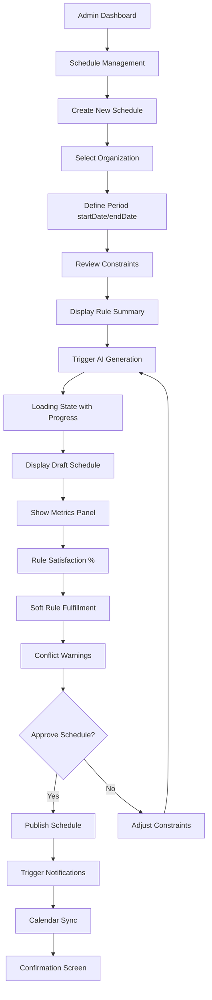
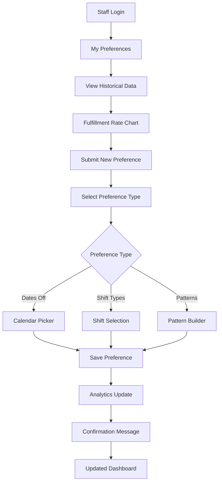
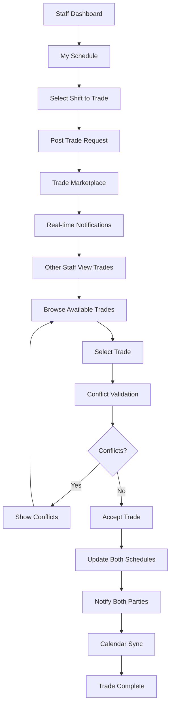
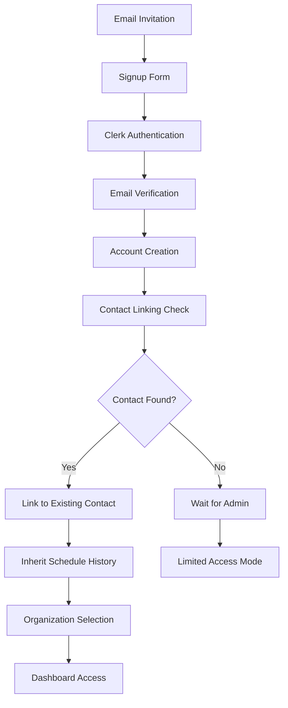

# 3. User Flows

## Critical Flow 1: AI Schedule Generation (Admin)

**UI Components Needed:**
- AI generation progress indicator
- Rule satisfaction metrics dashboard
- Conflict visualization panel
- Bulk approval interface

**Success Criteria:**
- Schedule generation completes in <30 seconds
- Clear display of rule fulfillment percentages
- One-click publish with notification confirmation

## Critical Flow 2: Preference Management (Staff)

**UI Components Needed:**
- Fulfillment rate charts and analytics
- Multi-type preference form
- Calendar date picker for unavailable dates
- Pattern builder for complex preferences

## Critical Flow 3: Shift Trading (Staff-to-Staff)

**UI Components Needed:**
- Trade marketplace with filtering
- Real-time notification system
- Conflict checker and validator
- Two-way calendar sync interface

## Critical Flow 4: User Registration & Contact Linking

**UI Components Needed:**
- Invitation acceptance flow
- Contact linking confirmation
- Organization selector for multi-org users
- Onboarding wizard for new users
